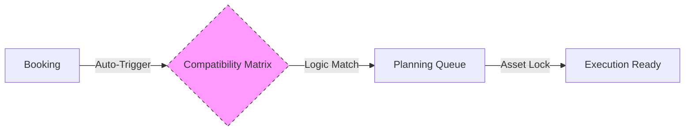

## Rebuilding the Connectivity Graph
Phase 2 focused on the "Handshake" logic that defines how data moves between modules. In Sinfomodal, these connections were often implicit or required manual triggers. 

## Process: Copying & Enhancing Logic
We successfully migrated the core relational logic for:
- **Node-to-Trace Mapping**: Ensuring every physical route is validated against terminal capabilities.
- **Subject-to-Asset Ownership**: Tracking which entities own or manage specific wagons/UTIs.

### The "Overload": Automated Connectivity
We significantly enhanced the connectivity by introducing **Event Triggers**. For example, when a Booking is created, the system now automatically polls the **Wagon Compatibility Matrix**—a process that was manual in many legacy workflows.



## Technical Excellence: Reference Integrity
We implemented a strict lookup layer to ensure that no "orphaned" nodes can exist. Every terminal and shunting zone must exist in the **GENERALE** registry before it can be used in a **DESIGN** service.

```javascript
// Example of the validation layer we added to the connectivity process
const ensureReferenceParity = (entityId, registry) => {
  const exists = checkRegistry(registry, entityId);
  if (!exists) {
    console.error(`Connectivity Error: ${entityId} not found in ${registry}`);
    return false;
  }
  return true;
};
```

## Data Lifecycle Improvement
By centralizing the data foundation in the **Exo Data Lake**, we achieved **Real-Time Consistency**. Unlike Sinfomodal, where multiple browser tabs could display conflicting data states, Magemo's connectivity layer ensures that a status update in **MONITORING** is instantly reflected in **ADMIN & REPORTS**.

<Frame caption="The Magemo Data Lifecycle: From Master Data to Operational Insight.">
  
</Frame>
