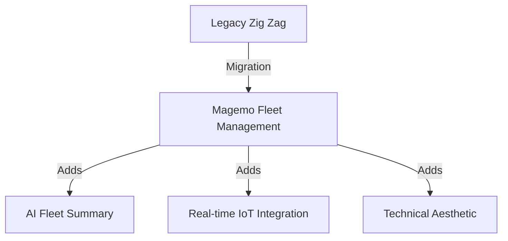

## The Migration of Zig Zag
One of the most important milestones in Phase 5 was the complete migration of the standalone **Zig Zag** tool into the unified **Magemo Fleet Management** suite. 

### What was "Zig Zag"?
Zig Zag was an independent fleet tracking application with its own database and UI patterns. We have now fully integrated it into the AI Loop architecture.

## The Process: Transformation & Renaming
We didn't just move the code; we transformed it:
1.  **UI Harmonization**: The original "flashy" Zig Zag interface was replaced with the **Magemo Technical HUD**.
2.  **Schema Unification**: Databases were moved from `db_ai-loop_FLEET_` to the core Magemo data structure.
3.  **Renaming**: To reflect its integral role, the module is now officially named **Fleet Management**.

## Core Functionalities Copied
We preserved the critical logic that made Zig Zag effective:
-   **Intelligent Autocomplete**: Search across all fleet databases simultaneously.
-   **Relationship Mapping**: Clicking a wagon instantly shows its current circulation (Muta), terminal allocation, and associated service.

### The "Overload": Unified Ops
The new **Fleet Management** is now "Operationally Aware". In the old standalone tool, tracking was passive. In Magemo:
-   **Event-Driven Status**: Asset positions are updated automatically via hooks into the **EXECUTION** module.
-   **AI Integration**: We added the **Summary** feature, which uses AI to scan thousands of fleet records and generate an executive report of maintenance deadlines and contract expirations—a task that previously took hours of manual work.

  <Frame caption="The new Fleet Management search interface, featuring the relationship discovery logic.">
    
  </Frame>
  <Frame caption="The AI-powered Fleet Status summary engine.">
    
  </Frame>

