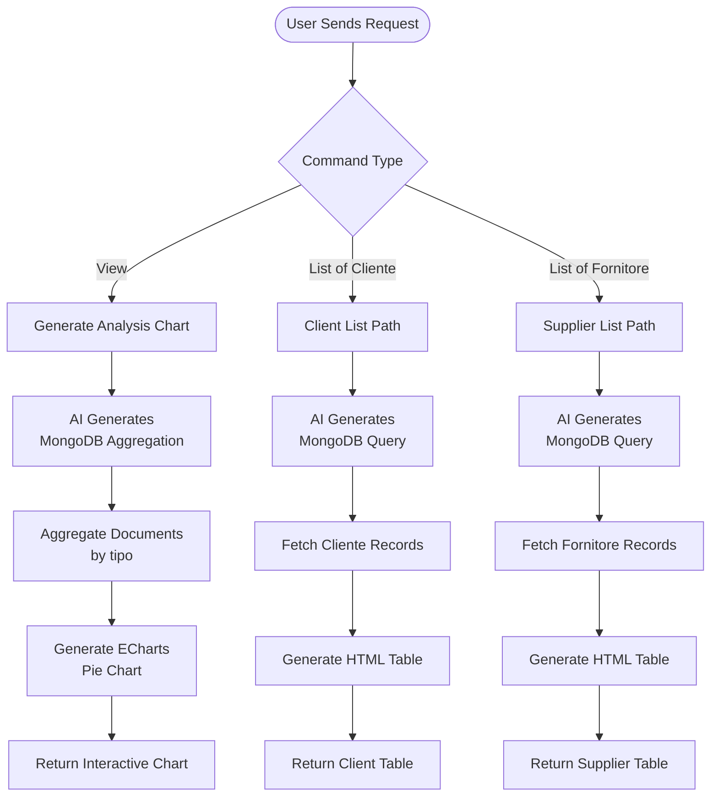

**Client Analysis** (Analisi Avanzata dei Dati Relativi ai Clienti) provides advanced analytics for client and supplier data using AI-generated MongoDB queries and interactive visualizations.

## Workflow Visualization

## What It Does

- **AI-Powered Queries**: Converts natural language to MongoDB queries.
- **Interactive Charts**: Generates pie charts for data visualization
- **Client Management**: Lists all active clients with complete details
- **Supplier Management**: Lists all active suppliers with complete information
- **Data Aggregation**: Groups and counts records by type and status

## Key Features

### AI Query Generation
- Natural language to MongoDB conversion
- Supports both find queries and aggregation pipelines
- Handles complex filtering conditions (tipo, active status)

### Visual Analytics
- Interactive ECharts pie chart
- Groups data by document type (Cliente, Fornitore, Non definito)
- Filters for active records only (active: 'yes' or null)
- Real-time data visualization

### Data Tables
- Dynamic HTML table generation
- All fields from anagrafica_completa collection
- Formatted with professional styling
- Responsive table layout

## Commands

### View

Generates an analysis report with pie chart showing distribution by type.

**No inputs required**

**Output:** Interactive pie chart showing active clients, suppliers, and undefined records

### List of Cliente

Retrieves complete list of all active clients.

**No inputs required**

**Output:** HTML table with all client details from anagrafica_completa

### List of Fornitore

Retrieves complete list of all active suppliers.

**No inputs required**

**Output:** HTML table with all supplier details from anagrafica_completa

## How to Use

<Steps>
  <Step>
    ### View Analysis Chart

    Use the "View" command to see an interactive pie chart showing the distribution of clients and suppliers.
  </Step>

  <Step>
    ### List Clients

    Use "List of Cliente" to get a complete table of all active clients with their details.
  </Step>

  <Step>
    ### List Suppliers

    Use "List of Fornitore" to get a complete table of all active suppliers with their information.
  </Step>
</Steps>

## Technical Details

**Database:**
- Collection: `datalake_main.db_ai-loop_anagrafica_completa`
- Logging: `datalake_main.db_ai-loop_flow_Logs`

**Query Filters:**
- `tipo`: "Cliente" or "Fornitore"
- `active`: "yes" or null (includes active and undefined status)

