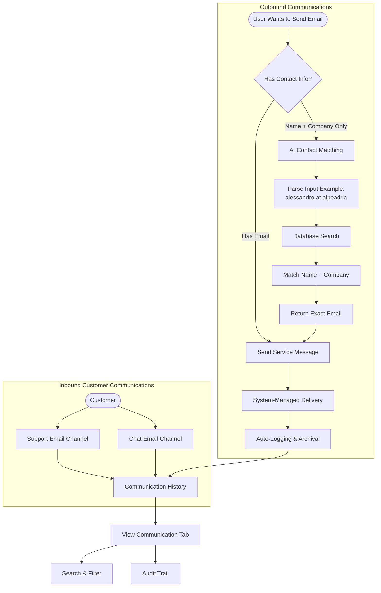

The **Communication System** provides a unified platform for managing all email communications with contractors, suppliers, and customers. The system centralizes email operations through dedicated service addresses and offers intelligent contact matching capabilities.

## Workflow Visualization

## Customer Enquiry Channels

The platform provides dedicated email addresses for customer communications:

- **`support@mail.wavecentric.ai`**: Primary channel for customer support and general enquiries.
- **`chat@mail.wavecentric.ai`**: Secondary channel for chat-based customer interactions and quick responses.

These dedicated addresses ensure all customer communications are properly routed and tracked within the system.

## Send Service Message

The **Send Service Message** tab enables users to compose and send emails to any business contact:

- **Unified Interface**: Single interface for sending emails to contractors, suppliers, and any other business contacts.
- **System-Managed Delivery**: All emails are routed through the centralized communication system, ensuring tracking and archival.
- **Structured Communication**: Every message sent through the system is automatically logged for future reference.

<Frame caption="Send Service Message interface for composing and sending emails to contractors and suppliers.">
  
</Frame>

## View Communication

The **View Communication** tab provides complete visibility into all sent messages:

- **Message History**: Chronological view of all communications sent through the system.
- **Search & Filter**: Quickly locate specific messages or communication threads.
- **Audit Trail**: Complete record of who sent what message and when.
- **Communication Tracking**: Track the status and delivery of all messages.

This ensures transparency and accountability in all business communications.

## AI-Powered Contact Matching

The platform implements **AI-powered contact matching** that resolves partial contact information to exact email addresses:

- **Natural Language Input**: Users can input contacts in natural language format (e.g., "alessandro at alpeadria").
- **Database Matching**: The AI engine searches the database for matching contacts based on name and company information.
- **Exact Email Resolution**: Automatically retrieves the correct email address from the database.
- **No Email Required**: Users can send emails without knowing the exact email address—only the name and company.

**Example Use Case**:
- **User Input**: "alessandro at alpeadria"
- **AI Processing**: Matches "Alessandro" (name) + "Alpeadria" (company) against database records
- **Result**: Retrieves exact email: `alessandro.rossi@alpeadria.com`

<Frame caption="AI-powered contact matching feature demonstrating natural language contact resolution.">
  
</Frame>

This feature significantly reduces friction in business communications, allowing users to focus on the message content rather than maintaining comprehensive contact lists.
