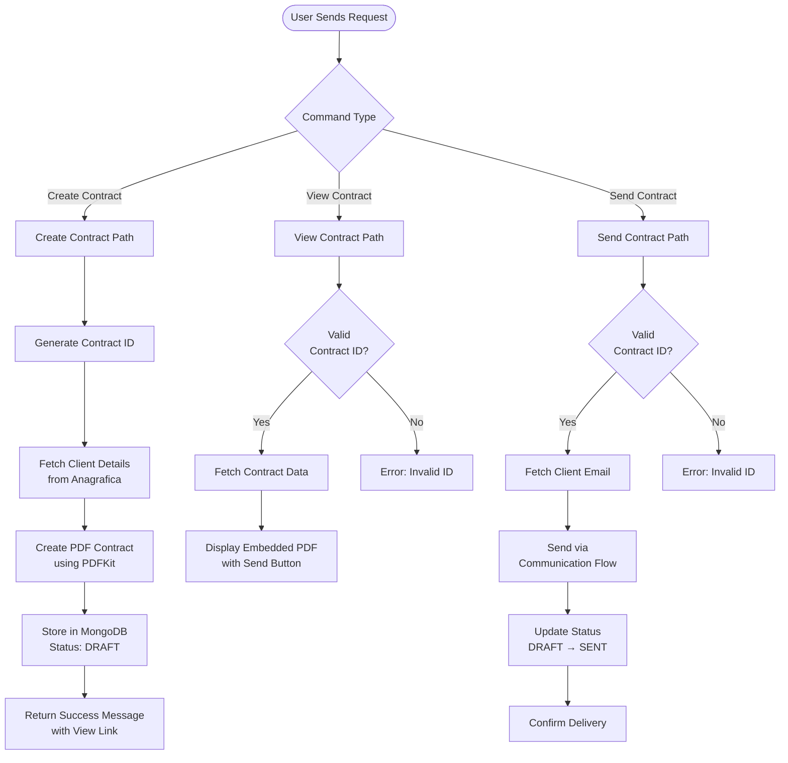

**Contract Management** (Gestione Contratti) generates professional service contracts using client and company details, creates PDF documents, and delivers them via email for review and signature.

[Open Contract Management →](https://ai-loop.alpeadria.com/ai-loop/flows?flow=gestione-contratti)


## Workflow Visualization



## What It Does

- **Contract Generation**: Creates service contracts with client and service details
- **PDF Creation**: Generates professional PDF documents with company branding
- **Email Delivery**: Sends contracts to clients via email with attachments
- **Status Tracking**: Manages contract lifecycle from DRAFT to SENT

## Key Features

### Contract Creation
- Client selection from available database
- Service selection (Rail Transport, Road Freight, Warehouse Storage)
- Automated contract ID generation
- Professional PDF formatting with AlpeAdria branding


### PDF Generation
- Company logo and footer integration
- Client contact details and address
- Service description and terms
- Payment terms and signature sections

### Email Integration
- Routes through Communication flow for delivery
- Attaches PDF contract as email attachment
- Updates contract status upon successful delivery

## Commands

### Create Contract

Creates a new contract draft with selected client and service.

**Inputs:**
```json
{
  "Cliente": "ALPHA S.R.L",
  "service": "Rail Transport"
}
```

**Output:** Success message with link to view the drafted contract

### View Contract

Displays the contract PDF with an option to send.

**Inputs:**
```json
{
  "contract_id": "CON-1234567890-5678"
}
```

**Output:** Embedded PDF viewer with contract details and send button

### Send Contract

Sends the contract to the client via email.

**Inputs:**
```json
{
  "contract_id": "CON-1234567890-5678"
}
```

**Output:** Email delivery confirmation and status update

## How to Use

<Steps>
  <Step>
    ### Create a Contract

    Select a client and service to generate a new contract draft. The system creates a unique contract ID and generates a PDF.
  </Step>

  <Step>
    ### Review the Contract

    Use the "View Contract" command with the contract ID to preview the PDF document before sending.
  </Step>

  <Step>
    ### Send to Client

    Once reviewed, use "Send Contract" to deliver the PDF to the client's email address for signature.
  </Step>
</Steps>


## Technical Details

**Database:**
- Contracts: `datalake_main.db_ai-loop_contract`
- Client Data: `datalake_main.db_ai-loop_anagrafica_completa`


**Available Services:**
- Rail Transport
- Road Freight  
- Warehouse Storage
