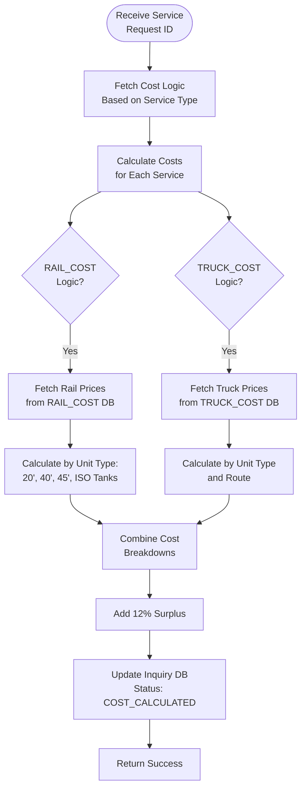

**Cost Calculation** processes service quotation requests by calculating costs based on rail and truck services, unit types, and quantities, then updates the inquiry with detailed cost breakdowns.

## Workflow Visualization

## What It Does

- **Cost Logic Retrieval**: Fetches appropriate cost calculation logic based on service type
- **Multi-Service Calculation**: Processes costs for multiple service requests simultaneously
- **Unit-Based Pricing**: Calculates costs per unit type (containers, ISO tanks, swap bodies, semi-trailers)
- **Route-Specific Pricing**: Applies pricing based on rail and truck service routes
- **Surplus Calculation**: Adds 12% surplus to final total cost

## Key Features

### Cost Components
- **Rail Cost**: Based on rail service and unit type
- **Truck Cost**: Based on door service or truck service ID
- **Quantity Multiplier**: Automatically multiplies unit prices by quantity
- **Cost Breakdown**: Detailed breakdown by unit type and service

### Pricing Logic
- Fetches pricing from `db_ai-loop_RAIL_COST` collection
- Fetches truck pricing from `db_ai-loop_TRUCK_COST` collection
- Matches unit types with available pricing data
- Calculates subtotals per service and grand total

## How to Use

<Steps>
  <Step>
    ### Inquiry Received

    After quotation management creates an inquiry, the system triggers cost calculation automatically.
  </Step>

  <Step>
    ### Cost Calculation

    The flow fetches pricing data, calculates costs for all units, and applies 12% surplus.
  </Step>

  <Step>
    ### Status Update

    Inquiry status updates to "COST_CALCULATED" with detailed cost summary stored in database.
  </Step>
</Steps>

## Technical Details

**Database:**
- Cost Logic: `datalake_main.db_ai-loop_Cost_Logic`
- Rail Pricing: `datalake_main.db_ai-loop_RAIL_COST`
- Truck Pricing: `datalake_main.db_ai-loop_TRUCK_COST`
- Inquiries: `datalake_main.db_ai-loop_CRM_Inquiries`

**Cost Calculation:**
- Surplus: 12%
- Unit detection: Size-based and type-based fallback logic
- Empty vs. full pricing differentiation
