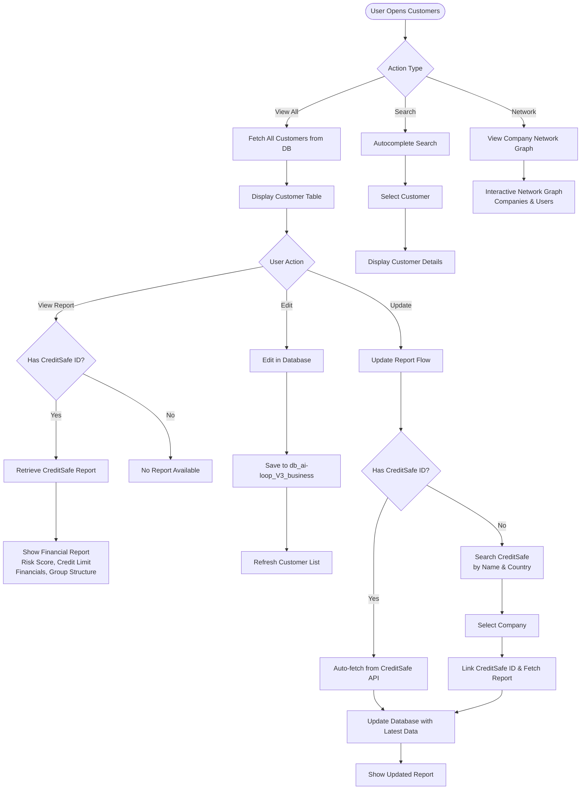

**Customers** provides comprehensive management of client and business data, integrating financial reports from CreditSafe. View, search, and update customer information with detailed credit risk assessments.

## Workflow Visualization

## What It Does

The Customers system enables you to:

- **View All Customers**: Display complete customer database in an interactive table
- **Search Customers**: Find specific clients by name, email, city, or CreditSafe ID
- **Financial Reports**: Access integrated CreditSafe credit reports and risk assessments
- **Update Reports**: Refresh customer financial data from CreditSafe
- **Network Visualization**: See company relationships and connected users in an interactive graph

## Key Features

### Customer Table
Browse all customers with essential information:
- Business name and contact details
- Location (city/country)
- CreditSafe ID for financial tracking
- Quick actions: View report, Edit data, Update from CreditSafe

[Open Customers →](https://ai-loop.alpeadria.com/ai-loop/flows?group=CENTRICO&flow=customers)

### Search Functionality
Autocomplete search across customer database fields to quickly locate specific clients or businesses.

### Credit Reports
Access detailed financial analysis for each customer including:
- Risk score and international credit rating
- Credit limit recommendations
- Financial statements and liquidity analysis
- Group structure and parent companies
- Payment trends and protest history

### Report Management
- **View Report**: Display comprehensive CreditSafe financial assessment
- **Update Report**: Fetch latest data from CreditSafe API
- **Manual Entry**: Add CreditSafe ID for customers without linked reports

### Network Graph
Visualize organizational relationships showing companies and their connected user accounts in an interactive network diagram.

## How to Use

<Steps>
  <Step>
    ### View Customer List
    Select "Customers" to display the complete table of all clients with name, email, city, and CreditSafe ID.
  </Step>

  <Step>
    ### Search Specific Customer
    Use the search function with autocomplete to find customers by any field. Results display detailed information.
  </Step>

  <Step>
    ### Access Financial Report
    Click the **View** icon next to any customer with a CreditSafe ID to see their complete credit report with risk analysis.
  </Step>

  <Step>
    ### Update Customer Data
    - Click **Edit** to modify customer details in the database
    - Click **Update** to fetch fresh data from CreditSafe
    - For new CreditSafe links, enter company name and country to search and select
  </Step>
</Steps>

## Database Integration

Customer data is stored in `db_ai-loop_V3_business` with fields including:
- Business name, email, contact information
- Location data (city, country code)
- CreditSafe ID for financial report linking
- Full CreditSafe report data (risk scores, financials, group structure)

