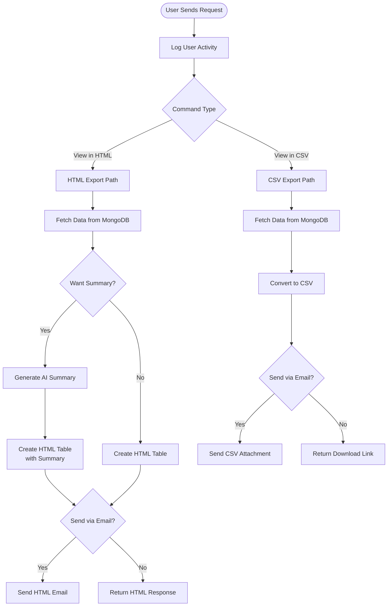

**Data Viewer** (Visualizzatore Dati) converts database data into downloadable CSV files or formatted HTML reports with optional AI summaries and email delivery.

## Workflow Visualization



## What It Does

- **Export to CSV**: Convert database collections to downloadable CSV files
- **Generate HTML Reports**: Create formatted HTML tables with optional summaries
- **AI Summaries**: Use AI model to generate 2-3 sentence data summaries
- **Email Delivery**: Send reports directly to specified email addresses
- **Activity Tracking**: Log all user requests and commands to MongoDB


[Open Data Viewer →](https://ai-loop.alpeadria.com/ai-loop/flows?flow=visualizzatore-dati&command=view-in-html)

## Key Features

### CSV Export
- Fetches data from MongoDB collection
- Converts to CSV format
- Creates downloadable file or sends via email

### HTML Reports
- Generates formatted HTML table
- Dynamic column headers from data
- Optional AI-generated summary

### Email Integration
- Professional email template with company branding
- HTML reports embedded in email body
- CSV files attached as attachments
- Sender: Admin Team (no-reply@mail.wavecentric.ai)

## How to Use

<Steps>
  <Step>
    ### Choose Export Format

    **For CSV Export:**
    Send request with command: `"View in CSV"`
    
    **For HTML Report:**
    Send request with command: `"View in HTML"`
  </Step>

  <Step>
    ### Configure Options

    **Email Delivery (Optional):**
    - Set `get_via_email`: `true`
    - Provide `recipient_email`: valid email address

    **AI Summary (HTML only):**
    - Set `get_summary`: `"yes"` for AI-generated summary
    - Set `get_summary`: `"no"` to skip summary
  </Step>

  <Step>
    ### Receive Results

    **Email delivery:**
    - CSV: Download attachment from email
    - HTML: View inline report in email

    **Direct response:**
    - CSV: Receive download link
    - HTML: Receive formatted HTML
  </Step>
</Steps>

## Command Structure

### View in HTML

```json
{
  "get_via_email": false,
  "recipient_email": "user@example.com",
  "get_summary": "yes"
}
```

**Options:**
- `get_via_email` (boolean, required): Send via email?
- `recipient_email` (string, optional): Email address
- `get_summary` (string, required): "yes" or "no"

### View in CSV

```json
{
  "get_via_email": false,
  "recipient_email": "user@example.com"
}
```

**Options:**
- `get_via_email` (boolean, required): Send via email?
- `recipient_email` (string, optional): Email address

## Technical Details

**Database Source:**
- Database: `datalake_main`
- Collection: `db_ai-loop_service.products`

**Activity Logging:**
- Collection: `db_ai-loop_flow_Logs`
- Logs user details and flow commands

**Email:**
- Sender: no-reply@mail.wavecentric.ai
- Subject: "Database details"
