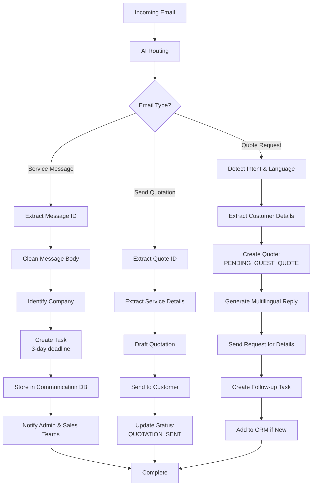

**Email Inbound** automatically processes incoming emails, classifies them by type, and routes them to the appropriate workflow. The system uses AI to intelligently categorize messages and extract relevant information for automated handling.

## What It Does

When an email arrives, the system:

1. **Classifies the email** into one of three categories using AI
2. **Extracts relevant information** based on the email type
3. **Creates tasks** or **processes quotes** automatically
4. **Notifies admin teams** of important messages
5. **Stores communication history** in the database

## Workflow Visualization

## Email Categories

### Service Message
Emails containing "Service Message" with a message ID format `[numbers-alphanumeric]`

**Processing:**
- Extracts message ID and cleans email body
- Identifies company from sender's email domain
- Creates task with 3-day deadline
- Stores in communication database
- Sends notification to Admin and Sales teams

### Send Quotation
Emails starting with "Follow up -" containing a quote ID format `QUOTE-numbers-numbers`

**Processing:**
- Extracts quote ID and service details (tipo_di_servizio, tipo_di_merce)
- Triggers quote drafting workflow
- Sends quotation to customer
- Updates quote status to `QUOTATION_SENT`
- Stores submission data in quotes database

### Quote Request (Other)
General inquiries that may be service quote requests

**Processing:**
- AI detects if email is requesting a quotation
- Extracts customer details (name, email, phone, language)
- Creates new quote with status `PENDING_GUEST_QUOTE`
- Sends automated reply in customer's language asking for:
  - **Type of service**: Door-to-Terminal, Door-to-Door, Terminal-to-Door, Terminal-to-Terminal
  - **Type of goods**: Intermodal/Non-intermodal units, Bulk, Hazardous goods, NHM/IMO codes
- Creates task for follow-up
- Adds customer to CRM if new

## AI-Powered Features

### Smart Classification
- Uses AI models to analyze email subject and determine category
- Handles variations like "Re:", "Fwd:", and parentheses in subjects

### Message Cleaning
- Removes email signatures and disclaimers
- Extracts only the main message content for processing

### Company Name Normalization
- Matches sender's domain against existing business database
- Ignores common legal suffixes (Inc, LLC, Ltd, GmbH, etc.)
- Returns official company name or creates new entry

### Automatic Tag Generation
- Creates descriptive 3-word tags for each email
- Format: lowercase, hyphen-separated

### Multilingual Responses
- Detects email language automatically
- Generates reply in customer's native language
- Supports any language, not limited to English/Italian

## Technical Details

- **Trigger**: Unauthenticated webhook (email forwarding endpoint)
- **Databases**: `datalake_main`, `ai-loop`
- **Collections**: 
  - `db_ai-loop_V3_Tasks` - Email tasks with deadlines
  - `db_ai-loop_quotes` - Quote requests and status
  - `db_ai-loop_V3_business` - Company information
  - `db_ai-loop_message_communication` - Email history
  - `db_ai-loop_System_Notifications` - Admin alerts
  - `users` - Customer profiles
- **Notification Teams**: Admin, Sales (configurable)

