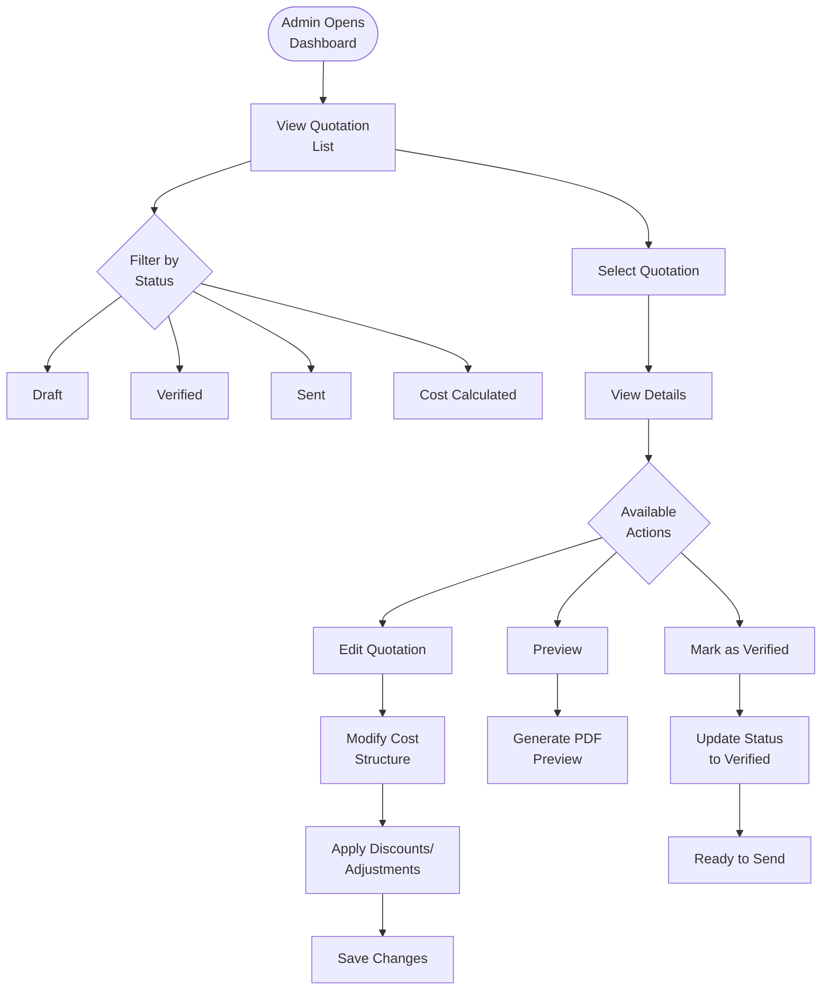

**Inquiry List** serves as the operational cockpit for sales and administration teams, providing a centralized view of all automatically generated offers with verification and editing capabilities.

## Workflow Visualization

## What It Does

- **Dashboard Overview**: Centralized view of all active quotations
- **Status Tracking**: Monitors quotation lifecycle (Draft → Verified → Sent)
- **Quick Actions**: Immediate access to View, Edit, and Preview functionalities
- **Cost Verification**: Review automatically generated pricing
- **Manual Adjustments**: Edit and customize cost structures before sending

## Key Features

### Automated Cost Generation
Upon inquiry creation, the Pricing Engine instantly calculates offers based on:
- **Service Type**: Predefined cost structures for specific logistics services
- **Inquiry Details**: Origin, destination, cargo type from customer request
- **Route Data**: Optimization data from Route Scanner

### Dashboard Visibility
- Comprehensive list of all active quotations
- Status tracking (Draft, Cost Calculated, Verified, Sent)
- Quick action buttons for each quotation

### Verification and Editing
- **Edit Option**: Modify auto-generated cost structures
- **Discounting**: Apply specific discounts or adjustments
- **Human Oversight**: Ensure pricing accuracy before customer transmission

## How to Use

<Steps>
  <Step>
    ### Access Dashboard

    Navigate to Inquiry List to see all active quotations with their current status.
  </Step>

  <Step>
    ### Review Quotation

    Select a quotation to view detailed cost breakdown, route information, and customer details.
  </Step>

  <Step>
    ### Edit if Needed

    Modify pricing, apply discounts, or adjust cost structures as required by sales strategy.
  </Step>

  <Step>
    ### Verify and Send

    Mark quotation as verified when ready, then proceed to send to customer.
  </Step>
</Steps>

## Technical Details

**Database:**
- Inquiries: `datalake_main.db_ai-loop_CRM_Inquiries`
- Quotations: Auto-generated from cost calculation flow
