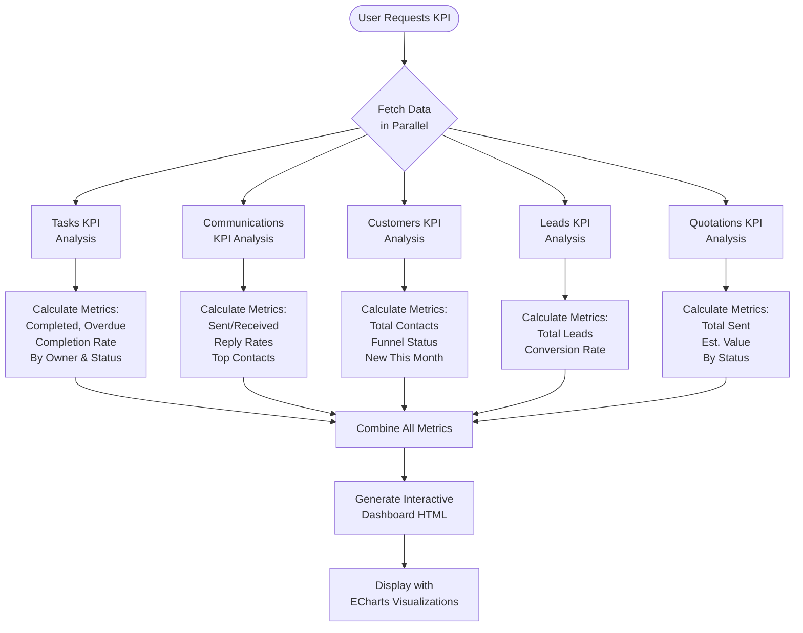

**KPI Dashboard** provides a comprehensive overview of business metrics across tasks, communications, customers, leads, and quotations with interactive visualizations and real-time data.

[Open KPI Dashboard →](https://ai-loop.alpeadria.com/ai-loop/flows?flow=kpi&command=kpi)

## Workflow Visualization

## What It Does

- **Real-Time Metrics**: Aggregates live data from multiple collections
- **Interactive Visualizations**: ECharts-powered doughnut charts and graphs
- **Comprehensive Overview**: Tasks, communications, customers, leads, and quotations
- **Performance Tracking**: Completion rates, reply rates, conversion rates

## Key Metrics

### Tasks
- Completed, overdue, and in-progress tasks
- Completion rate percentage
- Average time to complete (days)
- Activities by owner and status

### Communications
- Sent and received messages
- Reply rate and count
- Top 5 external contacts
- Not replied percentage

### Customers
- Total contacts and funnel distribution
- New contacts this month
- By funnel status (Default, Accepted, Draft, Sent, Expired, Rejected)

### Leads
- Total leads count
- Lead conversion rate percentage

### Quotations
- Total quotations sent
- Estimated cost this month
- Quotations by status (with breakdown)

## Commands

### KPI

Generates the complete business intelligence dashboard.

**No inputs required**

**Output:** Interactive HTML dashboard with all metrics and visualizations

## How to Use

<Steps>
  <Step>
    ### Open the Dashboard

    Run the "KPI" command to generate the real-time business intelligence dashboard.
  </Step>

  <Step>
    ### Review Metrics

    Explore the categorized sections: Tasks, Communications, Customers, Leads, and Quotations.
  </Step>

  <Step>
    ### Interact with Charts

    Hover over doughnut charts to see detailed breakdowns and percentages for each metric.
  </Step>
</Steps>

## Technical Details

**Database:**
- Tasks: `datalake_main.db_ai-loop_V3_Tasks`
- Communications: `datalake_main.db_ai-loop_message_communication`
- Business: `datalake_main.db_ai-loop_V3_business`
- Requests: `datalake_main.db_ai-loop_V3_Requests`

