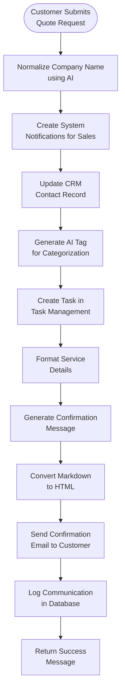

**New Inquiry** handles customer service quotation requests by collecting detailed requirements, creating tasks, sending notifications to the sales team, and delivering confirmation emails.

## Workflow Visualization

## What It Does

- **Service Request Collection**: Captures detailed service requirements with locations, goods specifications, and routes
- **Task Automation**: Creates tasks for sales team with 3-day deadline
- **Team Notifications**: Notifies Sales team members via system notifications
- **CRM Integration**: Updates customer contact records automatically
- **Email Confirmation**: Sends formatted confirmation emails to customers
- **Communication Logging**: Stores all interactions in the database

## Key Features

### Request Processing
- Multi-service support (multiple routes in one request)
- Location details (departure, destination, stopover)
- Goods specifications (Intermodal Units, Non-Intermodal, Bulk)
- Unit details with weights and quantities
- NHM, UN, CER, and ADR codes support

### AI-Powered Features
- Company name normalization using GPT-4.1-mini
- Automatic tag generation for categorization
- Intelligent matching with existing database records

### Task Management
- Automatic task creation with service request details
- 3-day deadline from submission
- Linked to customer company record
- Tags for easy filtering

### Notifications
- Sales team system notifications
- Email with clickable link to view request
- Real-time notification delivery

## Commands

### Send Quote

Submits a new service quotation request with location, goods, and unit specifications.

**Output:** Success confirmation with email sent to customer

## How to Use

<Steps>
  <Step>
    ### Submit Service Request

    Fill in all required fields including email, location details, goods specifications, and unit details.
  </Step>

  <Step>
    ### Receive Confirmation

    Customer receives confirmation email with complete service request details.
  </Step>

  <Step>
    ### Sales Team Notification

    Sales team members receive system notifications to prepare quotations within 3 days.
  </Step>
</Steps>

## Technical Details

**Database:**
- Service Types: `datalake_main.db_ai-loop_tipo_di_servizio`
- Goods Types: `datalake_main.db_ai-loop_tipo_di_merce`
- NHM Codes: `datalake_main.db_ai-loop_Codice_NHM`
- Business: `datalake_main.db_ai-loop_V3_business`
- Tasks: `datalake_main.db_ai-loop_V3_Tasks`
- Notifications: `datalake_main.db_ai-loop_System_Notifications`
- Communications: `datalake_main.db_ai-loop_message_communication`

**AI Integration:**
- Company normalization
- Tag generation
