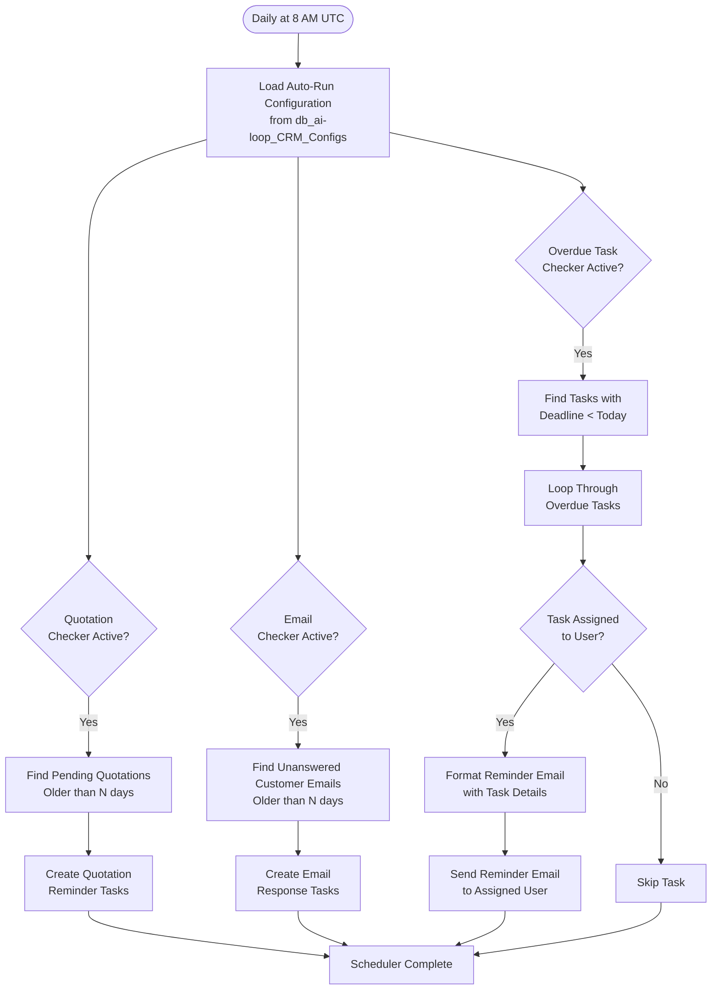

**Overdue Scheduler** runs automatically every day at 8 AM UTC to monitor pending work and send timely reminders. Ensures no customer request or task falls through the cracks.

## Workflow Visualization



## What It Does

The Overdue Scheduler automatically:

- **Monitors Pending Quotations**: Creates tasks when service requests lack quotations beyond the configured threshold
- **Tracks Unanswered Emails**: Identifies customer emails awaiting responses and generates follow-up tasks
- **Sends Task Reminders**: Notifies assigned users about overdue tasks via email

## Key Features

### Pending Quotation Monitoring
Scans `db_ai-loop_V3_Requests` for service requests with status not equal to `QUOTATION_SENT`:
- Checks age of each pending request
- Creates tasks for requests older than configured days (default: 3 days)
- Prevents duplicate task creation by checking existing tasks
- Includes customer details (name, email, company) in task description

### Unanswered Email Detection
Analyzes `db_ai-loop_message_communication` to find customer emails:
- Identifies threads where the last message is from the customer
- Calculates elapsed time since last customer message
- Creates tasks for emails unanswered beyond threshold
- Prevents duplicate tasks for already tracked emails

### Overdue Task Reminder System
Reviews `db_ai-loop_V3_Tasks` for overdue items:
- Finds tasks with deadlines before today
- Filters for non-completed and non-deleted tasks
- Formats personalized reminder emails with task details
- Sends emails only to tasks with assigned users

## Configuration

All settings are managed in `db_ai-loop_CRM_Configs` with key `auto_run`:

```json
{
  "quotation": {
    "active": true,
    "fire_days": 3
  },
  "email_not_answered": {
    "active": true,
    "fire_days": 3
  },
  "overdue_tasks": {
    "active": true,
    "subject": "⏰ Reminder: {{username}}, You Have Overdue Tasks",
    "body": "Hi {{username}},<br><br>You have overdue tasks requiring attention:<br><br>{{task_list}}<br><br>Please complete them as soon as possible."
  }
}
```

## Database Collections Used

- **db_ai-loop_CRM_Configs**: Configuration settings for automation
- **db_ai-loop_V3_Requests**: Service quotation requests
- **db_ai-loop_message_communication**: Customer email threads
- **db_ai-loop_V3_Tasks**: Task management and assignments

## Email Format

Overdue task reminder emails are sent from `task_manager@mail.wavecentric.ai` and include:

- **Subject**: Personalized with user's name
- **Body**: HTML-formatted with:
  - Task subject, description, and linked company
  - Direct link to task management page
  - Friendly, professional tone

**Example:**
```
Subject: ⏰ Reminder: john, You Have Overdue Tasks

Hi john,

You have overdue tasks requiring attention:

Subject: Quotation Reminder - REQ-12345
Description: The quotation for the service request is still pending...
Company: Example Corp Ltd

Check here: https://ai-loop.alpeadria.com/tasks
```

## Schedule

Runs daily at **8:00 AM UTC** using cron expression: `0 8 * * *`

