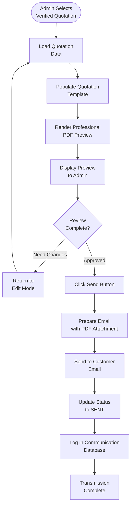

**Preview & Send** is the final stage in the quotation workflow, rendering verified data into a professional template and enabling one-click transmission to customers.

## Workflow Visualization

## What It Does

- **Template Rendering**: Dynamically populates quotation template with inquiry details
- **Professional Formatting**: Ensures uniform, branded appearance for all offers
- **Final Verification**: Allows last review before customer transmission
- **One-Click Send**: Single action to transmit offer to customer
- **Status Updates**: Automatically updates quotation status in dashboard

## Key Features

### Template Rendering
- **Dynamic Content**: Customer details, service specifications, final pricing
- **Professional Formatting**: Uniform and branded quotation appearance
- **PDF Generation**: High-quality, print-ready quotation documents

### One-Click Transmission
- **Send Action**: Single click triggers transmission via preferred channel
- **Flow Integration**: Completes quotation workflow and updates dashboard
- **Email Delivery**: Sends quotation as PDF attachment to customer

## How to Use

<Steps>
  <Step>
    ### Open Preview

    From Quotation View, select a verified quotation and click Preview.
  </Step>

  <Step>
    ### Review Template

    Verify all details are correct: customer info, services, routes, and pricing breakdown.
  </Step>

  <Step>
    ### Send to Customer

    Click the Send button to transmit the quotation via email with PDF attachment.
  </Step>

  <Step>
    ### Confirmation

    System updates status to SENT and logs the communication in the database.
  </Step>
</Steps>

## Technical Details

**Database:**
- Quotations: `datalake_main.db_ai-loop_CRM_Inquiries`
- Communications: `datalake_main.db_ai-loop_message_communication`

**Status Flow:**
- COST_CALCULATED → VERIFIED → SENT
