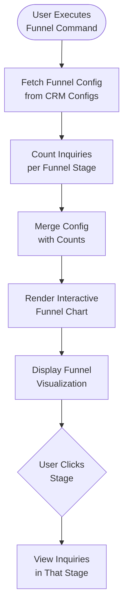

**Sales Funnel** provides a visual overview of the sales pipeline, enabling data-driven lead tracking from initial qualification through to successful conversion.

## Workflow Visualization

## Funnel Stages

The sales process is organized into distinct stages to provide clear visibility into your pipeline:

- **Lead**: Initial contact or inquiry
- **Qualified Lead**: Leads identified as a fit for your services
- **Proposal**: Active service offer and pricing submission
- **Negotiation**: Review and refinement of the proposal details
- **Contract Sent**: Formal agreement awaiting final authorization
- **Closed**: The finalization of the negotiation process
- **Won**: Successful conversion and commencement of the partnership

## Customer Insights

From the Sales Funnel, you can dive deep into individual customer profiles:
- **Communication History**: View all past messages and interactions with a specific lead
- **Task Overview**: See all open and completed tasks associated with the account
- **Inquiry History**: Track all service requests submitted by the customer
- **Business Analysis**: Access comprehensive reports and data analysis for each company

## Commands

### Funnel

Displays the sales funnel chart with current inquiry counts per stage.

**Output:** Interactive HTML funnel chart

## How to Use

<Steps>
  <Step>
    ### Execute Command

    Run the "Funnel" command to generate the visualization.
  </Step>

  <Step>
    ### View Pipeline

    See distribution of leads across all funnel stages with live counts.
  </Step>

  <Step>
    ### Navigate to Stage

    Click any funnel stage to view detailed inquiry list for that stage.
  </Step>
</Steps>

## Technical Details

**Database:**
- Funnel Config: `datalake_main.db_ai-loop_CRM_Configs`
- Inquiries: `datalake_main.db_ai-loop_CRM_Inquiries`
