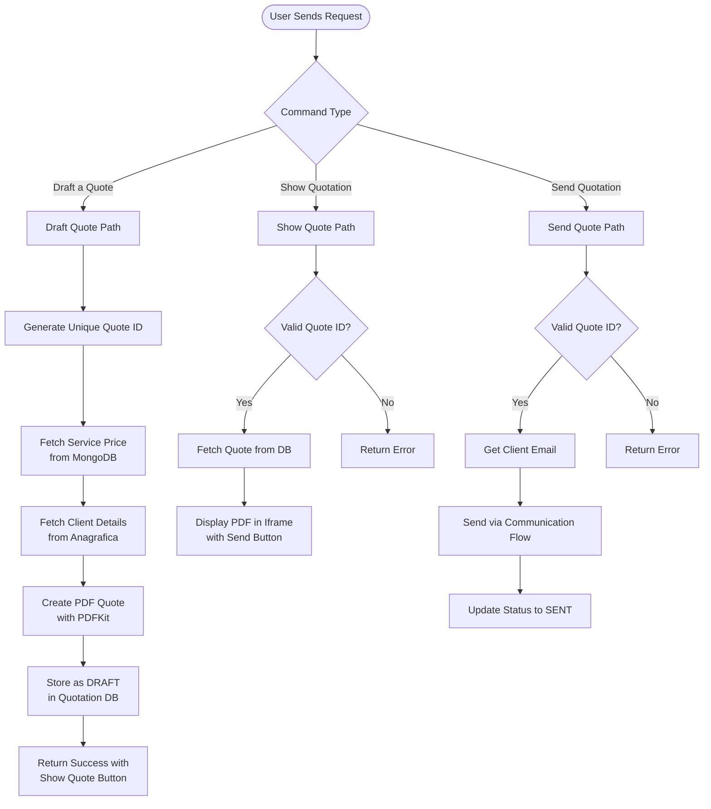

**Service Quote** (Preventivo di Servizio) generates professional service quotations with current pricing, creates PDF documents, and delivers them via email to clients.

## Workflow Visualization



## What It Does

- **Draft Quotes**: Generate professional PDF quotations with service details and pricing
- **Price Lookup**: Automatically fetch current service prices from database
- **Client Integration**: Pull client contact information from anagrafica database
- **PDF Generation**: Create formatted PDF documents with company branding
- **Email Delivery**: Send quotations directly to client email addresses
- **Status Tracking**: Manage quote lifecycle (Draft → Sent)


[Open Service Quote →](https://ai-loop.alpeadria.com/ai-loop/flows?flow=preventivo-di-servizio&command=draft-a-quote)

## Key Features

### Quote Drafting
- Select service type (Rail Transport, Road Freight, Warehouse Storage)
- Choose client from registered companies
- Specify origin and destination terminals
- Add custom notes and conditions
- Auto-generate unique quote ID with timestamp

### PDF Generation
- Professional template with company logo
- Client details (address, contact)
- Service details (type, route, pricing)
- Terms and conditions
- Payment terms (30 days)
- Company footer with contact information


### Email Integration
- Sends PDF as email attachment
- Retrieves client email from anagrafica database
- Routes through Communication flow
- Updates quote status after successful delivery

## Commands

### Draft a Quote

Creates a new quotation draft with service and client details.

**Inputs:**
```json
{
  "service": "Rail Transport",
  "Cliente": "ALPHA S.R.L",
  "from_terminal": "Terminal Milano",
  "to_terminal": "Terminal Hamburg",
  "notes": "Terminal handling\nCustoms clearance",
  "originated_by": "AlpeAdria S.p.A."
}
```

**Options:**
- `service`: Service type (Rail Transport, Road Freight, Warehouse Storage)
- `Cliente`: Client company name
- `from_terminal`: Origin terminal
- `to_terminal`: Destination terminal
- `notes`: Additional conditions (multiline)
- `originated_by`: Originating company (default: AlpeAdria S.p.A.)

### Show Quotation

Displays the PDF quotation with option to send.

**Inputs:**
```json
{
  "quote_id": "QUOTE-1718123456-7890"
}
```

### Send Quotation

Sends the quotation PDF via email to the client.

**Inputs:**
```json
{
  "quote_id": "QUOTE-1718123456-7890"
}
```

## How to Use

<Steps>
  <Step>
    ### Draft the Quote

    Select service type, client, terminals, and add any special notes or conditions.
  </Step>

  <Step>
    ### Review the Quote

    Use the "Show Quote" button to preview the PDF quotation before sending.
  </Step>

  <Step>
    ### Send to Client

    Click "Send Quote" to deliver the PDF quotation via email to the client's registered address.
  </Step>
</Steps>

## Technical Details

**Database Collections:**
- Source: `datalake_main.db_ai-loop_Service` (service pricing)
- Source: `datalake_main.db_ai-loop_anagrafica_completa` (client details)
- Storage: `datalake_main.db_ai-loop_quotation` (quote storage)
- Logging: `datalake_main.db_ai-loop_flow_Logs` (activity logs)

