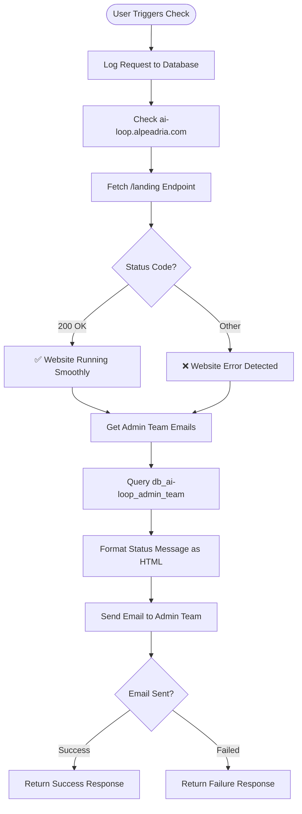

**Website Status Check** automatically monitors the AI-Loop website and sends status reports to the administrative team. Get instant notifications about website availability and performance.

## Workflow Visualization



## What It Does

The Website Status Check system provides:

- **Automated Monitoring**: Checks the AI-Loop website endpoint for availability
- **Health Verification**: Validates HTTP status codes and catches connection errors
- **Team Notifications**: Sends email alerts to the entire admin team
- **Status Logging**: Records all check requests for audit trail

## Key Features

### Website Health Check
Monitors the AI-Loop landing page (`https://ai-loop.alpeadria.com/landing`) and validates:
- HTTP response status (expects 200 OK)
- Connection availability
- Error detection and reporting

### Email Notifications
Sends formatted status reports including:
- ✅ Success message when website is running smoothly
- ❌ Error alerts with status codes or exception details
- Friendly, professional email format

### Admin Team Integration
Automatically retrieves recipient list from `db_ai-loop_admin_team` database, ensuring all administrators receive notifications without manual configuration.

## How to Use

<Steps>
  <Step>
    ### Trigger Website Check
    Execute the "Check Website Status" command to initiate the monitoring flow.
  </Step>

  <Step>
    ### Automated Process Runs
    The system automatically:
    - Checks website availability
    - Retrieves admin team emails from database
    - Formats status message as HTML
    - Sends notification email
  </Step>

  <Step>
    ### Review Status Report
    Admin team members receive an email with:
    - Website status (running or error)
    - Status code or error details
    - Timestamp of the check
  </Step>
</Steps>

## Database Integration

Uses two MongoDB collections:

**db_ai-loop_flow_Logs**: Stores execution logs with:
- User details (name, role, email, timestamp)
- Flow details (command, flow name, input parameters)

**db_ai-loop_admin_team**: Contains admin user records with email addresses for notification distribution.

## Email Format

Status emails are sent from `monitor@mail.wavecentric.ai` with subject **"⚡ AI-Loop Website Status"** and include:

**Success Message:**
```
✅ AI-Loop at ai-loop.alpeadria.com is running smoothly and ready to go!
```

**Error Message:**
```
❌ Website error: received status code [code]
```
or
```
❌ Exception while checking website: [error details]
```

