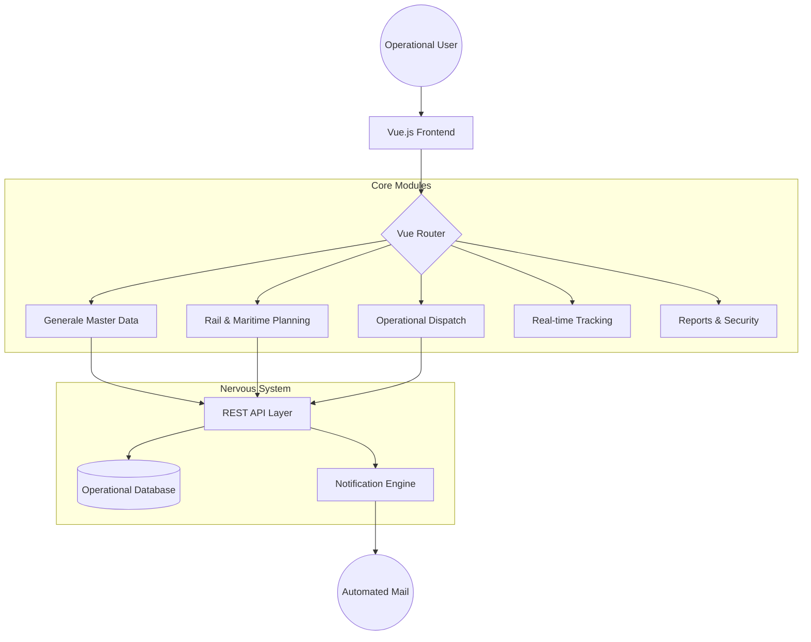

## 1. Vision & Purpose
The platform is a mission-critical Intermodal Transport Management System (TMS) designed for the seamless orchestration of rail and maritime logistics. The application prioritizes operational density, technical accuracy, and real-time data visibility over flashy visuals.

## 2. Architectural Overview

