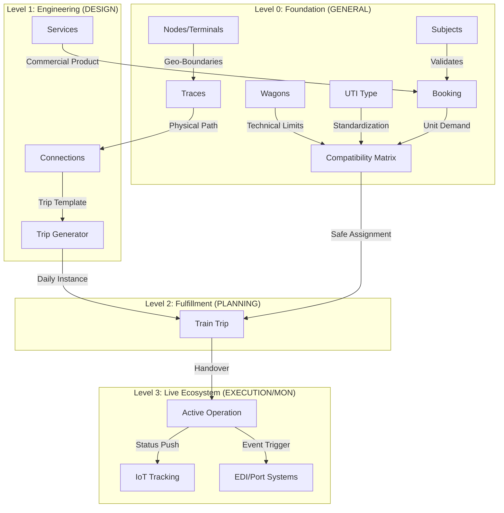

## 1. Vision & Purpose
**Magemo** is a mission-critical Intermodal Transport Management System (TMS) designed for the seamless orchestration of rail and maritime logistics. The architecture prioritizes **operational density**, **technical accuracy**, and **real-time data visibility**.

## 2. The Six Functional Pillars
The system is divided into six core modules that handle the end-to-end logistics lifecycle:

| Module | Core Responsibility |
| :--- | :--- |
| **GENERALE** | **Master Data Registry**. The single source of truth for physical assets (Wagons, UTIs, Nodes) and legal entities (Subjects). |
| **DESIGN** | **Product Engineering**. Defining the "Blueprints" for commercial transport services and traces. |
| **PLANNING** | **Commercial Fulfillment**. Converting client requests into technical loading plans and bookings. |
| **EXECUTION** | **Operational Dispatch**. Managing live movements, mission mandates, and transport documentation (CIM/BL). |
| **MONITORING** | **Real-Time Visibility**. Tracking assets via IoT (GPS) and terminal gate events. |
| **ADMIN & REPORTS** | **Business Intelligence**. Aggregating data for financial, performance, and volume analytics. |

## 3. Modular Relationship Map & State Dependencies
Data in Magemo moves through a strictly defined state machine. A record's existence in one module is often the prerequisite for another.

## 4. The Data Connectivity Chain: Enrichment Logic
Magemo is built as a **continuous data pipeline** where each module enriches the transaction rather than just storing it:

1.  **Registry Phase (GEN)**: Physical assets (Wagons/UTIs) and Legal entities are defined. These are "Passive" records.
2.  **Engineering Phase (DSG)**: Commercial "Products" (Services) are designed between validated Nodes. This defines the "Possible".
3.  **Strategic Phase (PLN)**: Bookings are created. Assets are assigned using the **Wagon/UTI Compatibility Matrix**. This defines the "Planned".
4.  **Operational Phase (EXE)**: Workflows are triggered (Trucking missions, Rail manifests). This is the "Live" state.
5.  **Visibility Phase (MON)**: Live status updates (Gate events, Nexxiot GPS) update the transaction state. This is the "Verified" state.
6.  **Analytical Phase (ADM)**: Final tonnage and financial KPIs are calculated. This is the "Archived/Audit" state.

## 5. Architectural Principles: Technical Accuracy
To support mission-critical logistics, the architecture adheres to these core principles:

### I. Reference Integrity
No operational module (e.g., Execution) can create "ad-hoc" nodes or subjects. Every field must point back to a validated record in the **Generale** module. This prevents "Data Drift" where the same port is spelled differently in different tables.

### II. The "Delta" Calculation
The system architecture is designed to calculate **Variances** (Deltas) automatically:
- **Planned vs Actual**: ETD vs ATD.
- **Contract vs Payload**: Allowed weight vs Loaded weight.
- **Estimated vs Final**: Calculated duration vs Real-time IoT stamps.

### III. External Handshakes
The architecture includes native "Handshake Layers" for:
- **PCS (Port Community Systems)**: For COPARN/COARRI EDI messages.
- **IM (Infrastructure Managers)**: For Web-CIM and Rail-Traces.
- **IoT (Fleet Providers)**: Direct API hooks for Nexxiot, Savvy, and other GPS providers.

## 6. Design Philosophy: The Technical Aesthetic
To support high-density logistics operations, the system follows these UI/UX standards:
- **Monochrome Palette**: Slate and Gray tones to reduce visual fatigue during 24/7 operations.
- **Data Density**: Compact grids and multi-tabbed forms to minimize scrolling.
- **In-Page Interfaces**: Inline form editing and side-panels instead of disruptive modals.
- **Contextual Actions**: Actions (like "Generate CIM") only appear when the underlying data state (e.g., "Train Confirmed") allows it.
