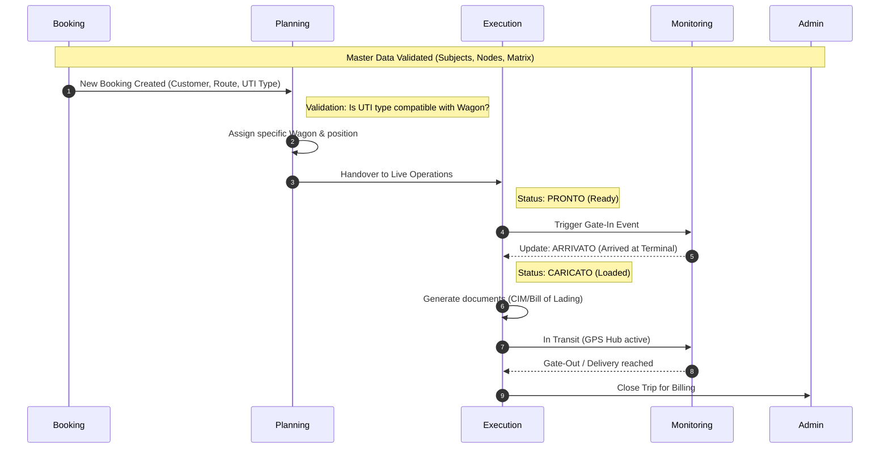
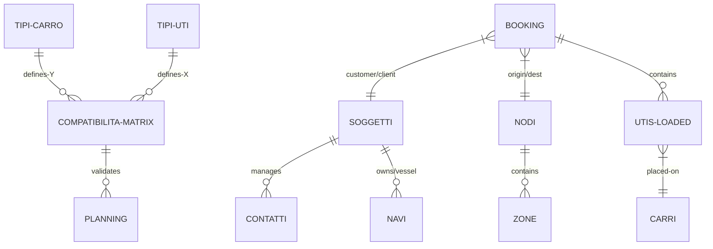
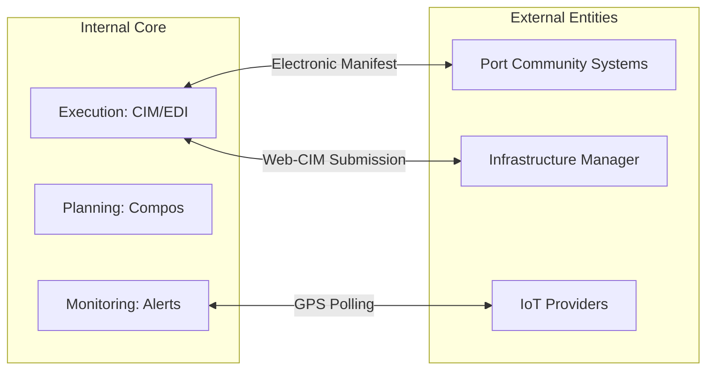

## 1. The Operational Lifecycle: Life of a Booking
The application tracks the lifecycle of an intermodal transport mandate from its inception as a commercial agreement to its closure and archival.

## 2. Core Entity Relationship
How the **General** module drives the rest of the system through strict foreign key relationships.

## 3. External Ecosystem & Integrations
Magemo acts as a central hub for multiple external stakeholders.

## 4. Key Connectivity Rules
1. **The Safety Validator**: The **Wagon/UTI Compatibility Matrix** is the mandatory gatekeeper. The **Planning** module cannot bypass this; if the matrix says "No", the system physically prevents the assignment to ensure rail safety.
2. **Dynamic Notification Hub**: The **Modelli Mail** system resolves contacts dynamically. It looks at the **Soggetto** in the Booking, finds the linked **Contati**, and filters by `Tipologia` (e.g., "Operations") and `Ufficio` (e.g., "Export") to send the correct PDF to the correct human.
3. **Master Data Propagation**: A change in the **Generale** module (e.g., updating a Wagon's "Soglia Lunghezza") propagates instantly. The next time that wagon is used in **Planning**, the new length is used for the total train composition calculation.
4. **Calculated Dependencies**: The **Admin** module calculates final tonnage only when the **Execution** module marks the trip as `CHIUSO` (Closed), ensuring financial reports only use verified operational data.
