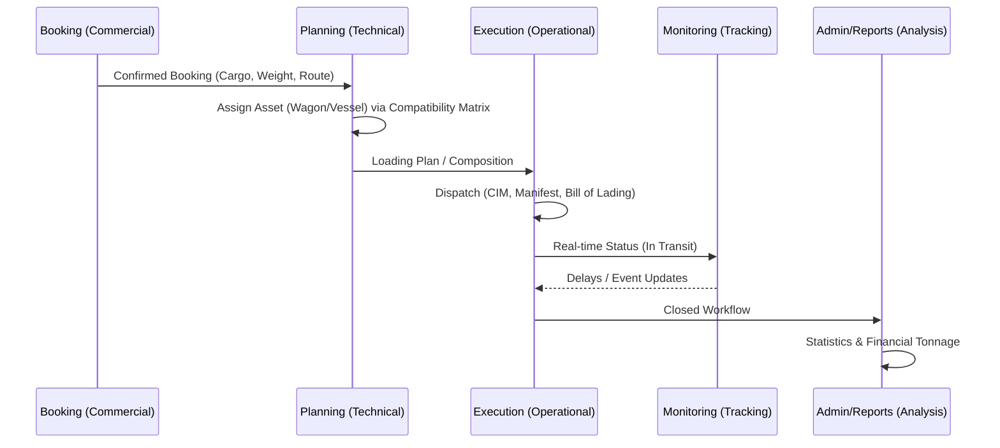
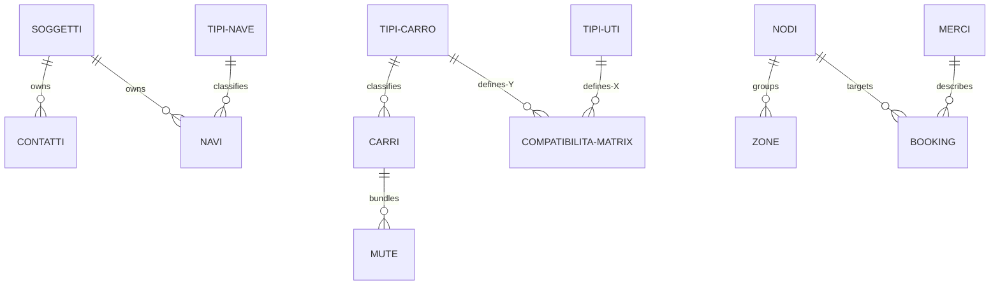
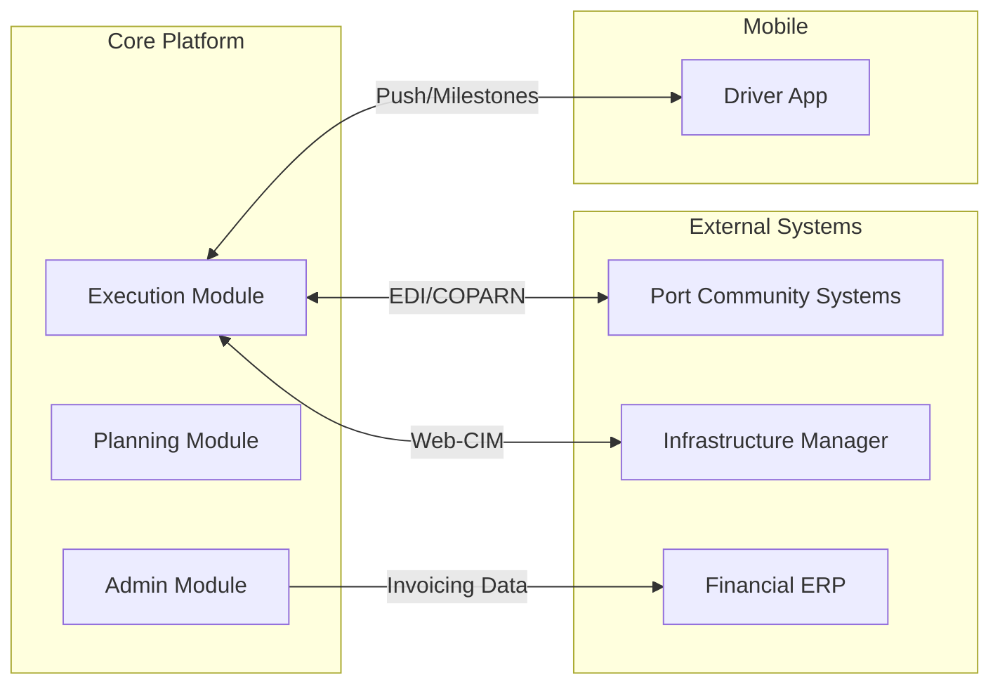

## 1. The Operational Lifecycle
The application tracks the lifecycle of an intermodal transport mandate from its inception as a commercial agreement to its closure as a historical record.

## 2. Core Entity Relationship
How the "General" module drives the rest of the system.

## 3. External Ecosystem & Integrations
The system does not operate in a vacuum. It acts as a central hub for multiple external stakeholders and technical systems.

## 4. Key Connectivity Rules
1. **The Safety Validator**: The **Wagon/UTI Compatibility Matrix** is the fundamental rulebook. No cargo (UTI) can be loaded onto an asset (Wagon) without an explicit "Pass" from this matrix.
2. **The Notification Hub**: The **Modelli Mail** system resolves contacts dynamically from the **Contatti** registry based on the **Soggetto** linked to the current booking.
3. **Master Data Dependency**: Every operational transaction (a "Viaggio" or "Booking") is strictly a pointer to the **Master Data** module. Modifications in "General" (e.g., updating a Wagon's weight limit) propagate immediately to the **Planning Engine**.

## 5. Critical Data Points
- **IMO Number**: The universal key for Maritime tracking.
- **Matricola**: The unique key for Rail assets.
- **ISO Size Type**: The standardization key for Cargo dimensions.
- **LoCode**: The international key for geographic Nodes.
