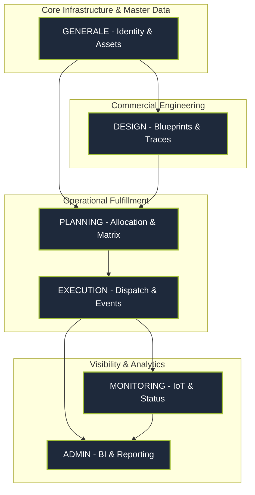
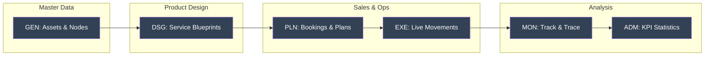

## 1. The Global Architectural Vision
Phase 1 established the **Unified Blueprint** for Magemo. We moved away from the fragmented approach of legacy systems to a **Six-Pillar Modular Architecture**. Every module was analyzed, designed, and architected to work as a single, cohesive "Logistics ERP".

### The Modular Ecosystem Blueprint
This diagram represents the architectural design of the complete system, showing how the six core modules interlock to form the foundation.

## 2. Integrated Module Design Analysis
We deep-dived into each functional area to architect a system that ensures 100% data integrity and operational velocity.

### I. Foundation Design: GENERALE Hub
We architected the **Single Source of Truth** for the entire network.
- **Identity & Compliance**: Mapping legal entities (Subjects) with fiscal IDs and notification roles.
- **Topology Architecture**: Designing the physical network nodes (Terminals/Stations) with geo-precision and activity types.
- **Technical Assets**: Unified registry for Wagons and UTIs, enforcing UIC and ISO 6346 standards.

### II. Engineering Design: DESIGN Module
Architecture of the "Logistics Blueprint" to standardize commercial offerings.
- **Service Schemas**: Defining the commercial name, valid date ranges, and type of transport.
- **Trace Templates**: Slot-level design capturing Train Numbers, IM Handshakes (M53), and physical limits (Max Lenght/Weight).
- **Physical Adjacency**: Pre-calculating distances and connectivity between nodes.

### III. Fulfillment Design: PLANNING & MATRIX
Analytical design of the resource allocation and safety engine.
- **Tetris Loading Logic**: Multi-dimensional UI for assigned units to wagons with real-time feedback.
- **Compatibility Matrix**: The primary architectural gatekeeper, cross-referencing Wagon vs. UTI profiles to ensure rail safety.

### IV. Workflow Design: EXECUTION & MONITORING
Designing the "Live Ecosystem" where the technical plan meets physical movement.
- **Event-Driven Dispatch**: Translating loading plans into manifests (CIM/BL) and EDI handshakes.
- **Geographic Awareness**: Designing geofence-triggered milestone updates for real-time visibility.

### V. Analytical Design: ADMIN & STATISTICS
Architecture for high-fidelity business intelligence.
- **Data Ripening**: Designing the transition of data from "Planned" (Booking) to "Verified" (Execution) to "Audited" (Admin).
- **KPI Aggregation**: Multi-dimensional pivot cubes for Tonnage, Load Factor, and Delay Analytics.

## 3. The Transport Lifecycle Architecture
The entire Transport Management Lifecycle was mapped and designed in Phase 1 to ensure a seamless "Order-to-Cash" flow.

## 4. Technical Design Standards: Dual-Core Architecture
- **Operational Registry Core**: Designed for fast data entry and individual record integrity.
- **Analytical Engine Core**: Designed for multi-dimensional aggregation and historical auditing (Sinfostats).
- **Inter-Module Handshakes**: Physical prevention of "orphaned" records across module boundaries.

## Key Deliverables
- **Unified Modular Schema**: Database design for all 6 modules.
- **System-Wide ERD**: The complete entity relationship diagram.
- **State Machine Engine**: The logical rules governing the transport lifecycle.
