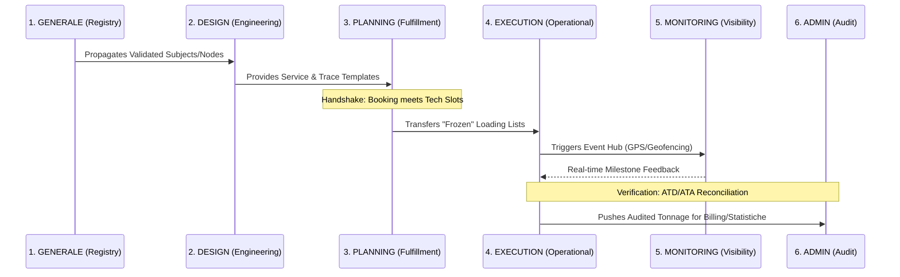
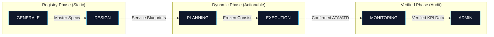

## 1. The Inter-Module Connectivity Chain
If Phase 1 was the "Map", Phase 2 is the "Roads". We architected and implemented the **Propagation Logic** that allows data to flow seamlessly between the six functional modules. This ensures that every operation is driven by a chain of verified events.

### The Connectivity Orchestration Diagram
This diagram illustrates the technical "Handshakes" and recursive data loops that occur as a transport mandate matures.

## 2. Technical Connectivity Deep-Dive
Phase 2 implemented the mandatory links that eliminate the manual data entry hurdles found in legacy systems.

### I. The Commercial-to-Technical Handshake (DESIGN ↔ PLANNING)
- **Blueprints**: The system now automatically generates daily voyages from the **Services** templates defined in the Design module.
- **Reference Integrity**: A booking cannot exist without a link to a **Service**, which in turn must link to a physical **Connection**.

### II. The Structural Validity Engine (GENERALE ↔ PLANNING)
- **Automatic Polling**: When a planner adds a wagon to a train, the system polls the **Equipment Registry** for its `Tara` and `Lunghezza`.
- **The Matrix Check**: Instant validation of the loading combination against the **Compatibility Matrix** (Wagon Type vs. UTI Type).

### III. The Physical-to-Digital Loop (EXECUTION ↔ MONITORING)
- **Standardized Event Hub**: Movement triggers in **Rail Ops** (Execution) are broadcast to the **Track & Trace** board (Monitoring).
- **Geofence Handshake**: Direct integration with **Nexxiot** sensors to automatically confirm ETA/ATA against the planned schedule.

### IV. The Operational-to-Analytical Audit (EXECUTION ↔ ADMIN)
- **Batch Processing**: Designing the **Sinfostats** data ingestion utility (Aggiornamento Statistiche) that moves data from the live operational DB to the analytical pivot hub.

## 3. Data Integrity & Life Cycle
The architecture ensures that data "Ripens" as it travels through the connectivity chain, gaining fidelity with every module.

## 4. Architectural Enhancements: The "Integrated Logic"
- **Cascade Updates**: Updating a Terminal Node in **GENERALE** correctly propagates to every active **Trace** and **Booking**.
- **Self-Healing State Machine**: If a movement is canceled in **Execution**, the **Monitoring** module automatically resets the milestones to "Planned".
- **Unified Logic Hub**: One single source of code for weight and length calculations used by Planning, Execution, and Stats.

## Key Deliverables
- **The Global Handshake Engine**: Automated data transfer logic between modules.
- **State Transition Orchestrator**: Logic governing the lifecycle of a transport mandate.
- **Real-Time Consistency Gate**: 100% prevention of orphaned or invalid technical records.
