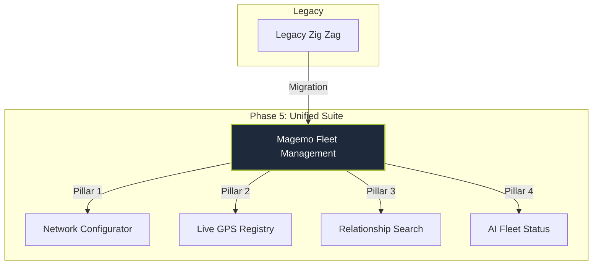

## The Transformation: From Zig Zag to Fleet Management
A major milestone of Phase 5 was the complete analysis and migration of the standalone **Zig Zag** tracking tool into the unified **Magemo Fleet Management** suite. Originally an independent application with isolated data silos, it has been reimagined as the central nervous system for asset tracking and network modeling.

## Core Pillars of the Fleet Management Suite

The suite is built on four technical pillars that provide 360-degree visibility and simulation capabilities:

### 1. Network Configurator (The "Zig Zag" Engine)
The configurator empowers users to dynamically model logistics networks through visual graph generation.
- **Dynamic Topology**: Visual node linking to create custom "train graphs" for simulation.
- **"What-If" Scenarios**: Running simulations on generated graphs to evaluate the impact of new rail links or terminal changes without affecting production data.
- **Orchestration Integration**: Seamless handover of generated graphs to the Orchestrator's routing algorithms.

### 2. Live Fleet Registry (Flotta Carri)
Provides real-time GPS tracking and physical visualization of the entire wagon fleet.
- **Nexxiot Integration**: Direct API handshake with Nexxiot for high-frequency GPS coordinate retrieval.
- **Movement Status**: Real-time identification of assets as **in movimento** (moving) vs. **in piedi** (stationary).
- **Interactive Mapping**: Leaflet-powered maps featuring marker clustering, pulsing movement animations, and instant hover-tooltips for technical wagon data.

### 3. Intelligent Relationship Search
A high-performance search system that maps the hidden connections between fleet entities.
- **Multi-Database Autocomplete**: Searches across `muta` (circulation), `services`, `carri` (wagons), and `terminals` simultaneously.
- **Recursive Navigation**: Clickable relationship links that allow an operator to navigate from a Wagon ID to its current terminal allocation, and then to the service it is fulfilling.
- **Data Highlight**: Visual color-coding for status (TRUE/FALSE) and automatic timestamp formatting.

### 4. Fleet Status & AI Intelligence
Advanced analytical tools that transform raw data into executive-level insights.
- **Interactive Visualization**: ECharts-powered distribution charts grouped by attributes like *PESO*, *MODELLO*, *TIPO*, and *ASSI*.
- **AI-Loop Assistant**: An AI-powered engine that analyzes thousands of records to identify:
    - **Maintenance Deadlines**: Identifying wagons approaching ECM thresholds.
    - **Contract Expirations**: Scanning rental and service agreements for disdetta (cancellation) windows.
    - **Operational Health**: Generating printable executive summaries for weekly management reviews.

## Key Deliverables
- **Unified Fleet Ledger**: Integration of all legacy tracking data into the Magemo GENERALE module.
- **Autonomous Visibility**: Automated milestone triggering based on GPS geofencing.
- **Predictive Maintenance Hub**: AI-driven alerts for fleet technical thresholds.

## Quick Links
- [Fleet Configurator](/magemo/fleet/configurator)
- [Live Map (Flotta Carri)](/magemo/fleet/registry)
- [Relationship Search](/magemo/fleet/search)
- [AI Fleet Status](/magemo/fleet/status)
