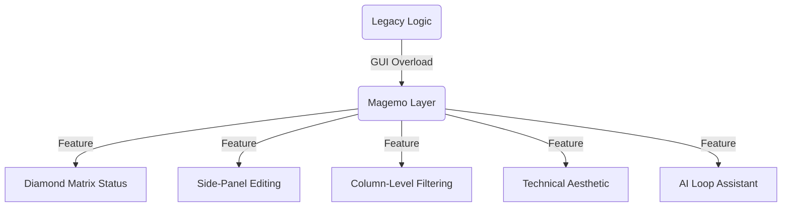

## Beyond Sinfomodal: The Experience Layer
The **Experience Layer** is our most significant departure from Sinfomodal. While legacy systems were "Registry-First" (focusing on data entry), Magemo is **"Outcome-First"**, designed for high-velocity decision making.

## What We Do Better: Tactical UI/UX
We identified the most common operational friction points and solved them with technical GUI innovations:

### 1. The "Diamond Matrix": Visual Readiness
In Planning and Booking, we replaced complex status tables with the **Diamond Matrix**. This at-a-glance indicator shows the readiness of four distinct modules for a single shipment:
*   **BK (Booking)**: Commercial confirmation.
*   **TR (Train)**: Rail planning status.
*   **TT (Truck)**: Dispatch readiness.
*   **DO (Doc)**: Mandatory documentation status.
*   **Status Colors**: Green (Ready), Yellow (Pending), Red (Blocked), Gray (N/A).

### 2. Side-Panel Workflows & Context Retention
Unlike legacy systems that force users to navigate away from their current view, Magemo implements **Side-Panel Editing**. Operators can update a loading list or modify a subject's email while keeping the main Planning Grid or Execution Board visible.

### 3. The Technical HUD (Decision Engine)
We moved away from flashy, fatigue-inducing colors to a **Technical HUD** aesthetic:
- **Monochrome Slate Palette**: High-density data views that minimize eye strain during 24/7 operations.
- **State-Aware Actions**: Buttons like "Generate CIM" or "Trigger EDI Handshake" only become active when the trip state machine validates the underlying data.

### 4. Advanced Column-Level Filtering
Legacy systems typically offer a single Global Search box that becomes inefficient with high data volumes.
- **Magemo Solution**: We implemented **Multi-Select Column Filtering**. Every data column (e.g., *Categories*, *Roles*) features its own searchable dropdown. This allows operators to build complex, multi-dimensional views (e.g., "Show all *Trasportatori* based in *Milan* with *Active* status") in seconds.

<Frame caption="Implementation of Multi-Select Column Filtering for enhanced data navigation.">
  
</Frame>

### 5. Integrated Relationship Discovery
In legacy software, navigation was hierarchical. In Magemo, it is **Recursive**. Every entity is a link—clicking a Wagon opens its technical profile, clicking the profile opens the linked Muta, and clicking the Muta opens the service timeline.

## Results: Operational Intelligence
Phase 6 transforms Magemo from a database into a **Decision Engine**. Every screen is designed to surface "Deltas"—where the reality of the field deviates from the plan—allowing operators to act with precision and speed.

## Quick Links
- [Dashboard Personalization](/functionalities/dashboard-personalization)
- [Booking Diamond Matrix](/magemo/modules/planning/booking#3-the-status-matrix-visual-indicators)
- [AI Assistant Guide](/functionalities/ai-assistant)
- [Operational Reports](/magemo/modules/admin/reports)
