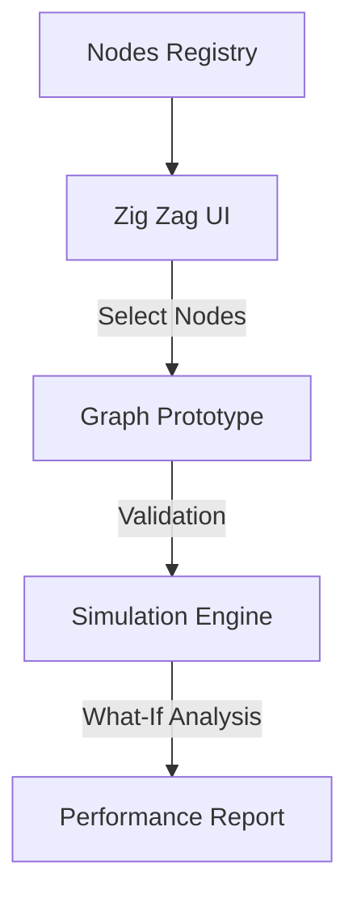

## 1. Overview
The **Zig Zag Configurator** is the primary engine for **Railway Graph Generation**. It allows users to visually construct complex railway paths by linking distinct network nodes to create custom "train graphs" for testing and network design.

## 2. Graph Generation Workflow

## 3. Key Features

### Graph Construction
Users can link distinct network nodes (terminals, hubs) to create a custom "train graph." The interface provides immediate visual feedback on the connectivity and validity of the proposed segments.

### Simulation & Analysis
Once a graph is generated, it becomes an input for the simulation engine. The system evaluates distinct logistics variables (different providers, timetables) on this newly generated topology.

## 4. Technical Enablement
*   **Graph-in-Memory**: The system creates temporary, in-memory graph structures that exist solely for the user's session.
*   **Orchestrator Integration**: The generated graph is natively understood by the routing algorithms for immediate feasibility testing.

## 5. Navigation
*   **Menu Path**: `Fleet Management > Zig Zag`
