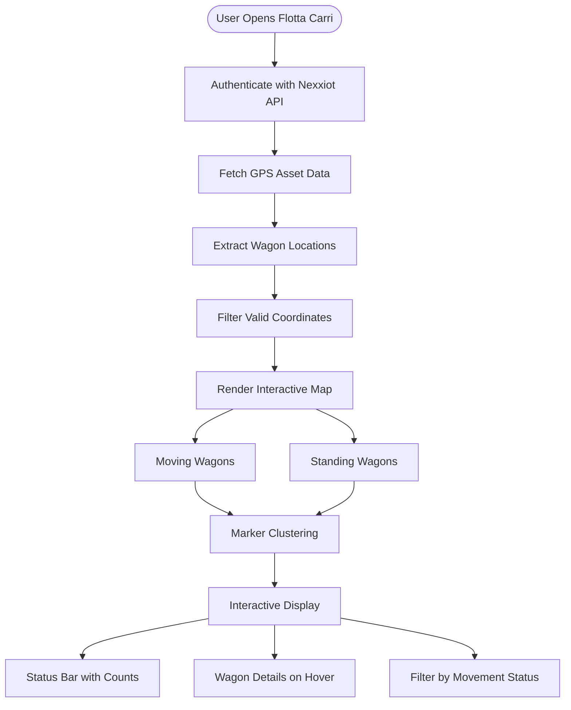

**Flotta Carri** provides real-time GPS tracking of railway wagons using location data from Nexxiot API. View all tracked wagons on an interactive map with movement status, location details, and wagon information.

## Workflow Visualization

## Key Features

### Real-Time GPS Tracking
- Fetches live wagon locations from Nexxiot third-party API
- Displays GPS coordinates on interactive Leaflet map
- Auto-centers map on fleet location

### Movement Status Visualization
- **Moving Wagons**: Blue truck icons (🚚) with pulsing animation
- **Standing Wagons**: Gray truck icons (🚚) 
- **Status Bar**: Shows real-time counts
  - "in movimento" - moving wagons count
  - "in piedi" - standing wagons count
  - "tutto" - total wagon count

### Interactive Map Controls
- **Click Status Bar**: Filter wagons by movement state
- **Hover on Markers**: View wagon details instantly
- **Marker Clustering**: Groups nearby wagons for cleaner visualization
- **Zoom & Pan**: Navigate across the entire fleet

### Wagon Information
Each wagon marker displays:
- **EVN**: Unique wagon identifier
- **Type**: Wagon type classification
- **Status**: Moving or Standing
- **Location**: Current address/display name
- **Time**: Last GPS measurement timestamp

[Open Flotta Carri →](https://ai-loop.alpeadria.com/ai-loop/flows?flow=flotta_carri)

## How It Works

<Steps>
  <Step>
    ### 1. API Authentication
    System authenticates with Nexxiot API to access GPS tracking data.
  </Step>

  <Step>
    ### 2. Fetch Wagon Data
    Retrieves all assets with:
    - GPS coordinates (latitude, longitude)
    - Movement state (moving/standing)
    - Wagon metadata (type, EVN)
    - Location details and timestamps
  </Step>

  <Step>
    ### 3. Map Visualization
    Renders interactive map with:
    - Moving wagons: Blue icons with pulse animation
    - Standing wagons: Gray static icons
    - Clustered markers for dense areas
    - Status bar with live counts
  </Step>

  <Step>
    ### 4. User Interaction
    Users can:
    - Filter by clicking status counts
    - Hover for wagon details
    - Zoom to specific regions
    - Track individual wagons
  </Step>
</Steps>
