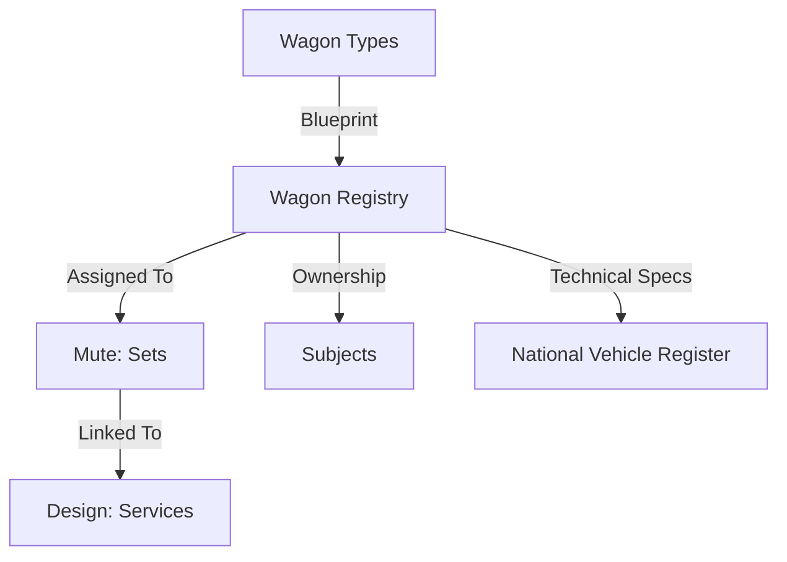

## 1. Overview
**Flotta Carri** (Fleet Registry) serves as the definitive master record for every piece of rolling stock in the network. It acts as the "Birth Certificate" for each wagon, storing immutable technical data and evolving ownership details.

## 2. Fleet Data Relationships

## 3. Core Data Entities

### General Identity
*   **Wagon Number (UIC)**: The unique 12-digit identifier (e.g., `33 87 457 6 200-1`).
*   **Wagon Type**: Link to the *Wagon Types* master data (e.g., `Sggnss 80'`).
*   **Series**: The generic series classification.
*   **Registration Country**: The country code of the wagon's registration.

### Technical Specifications
*   **Tare Weight**: The empty weight of the wagon (crucial for train mass calculations).
*   **Load Limit**: Maximum payload capacity.
*   **Axle Count**: Number of axles (determining track access charges).
*   **Brake Type**: The braking regime (e.g., P/G, K-blocks) affecting speed limits.
*   **Internal Length**: Usable loading length for containers/trailers.

### Maintenance & Lifecycle
*   **Immatriculation Date**: When the wagon first entered service.
*   **Last Revision**: Date of the last major overhaul.
*   **Next Revision Due**: Calculated deadline for mandatory inspection.
*   **Wheelset Data**: Specific tracking of wheelset diameters and wear.

### Ownership & Leasing
*   **Keeper (VKM)**: The Entity in Charge of Maintenance (ECM) (e.g., `VTG`, `ERMEWA`).
*   **Owner**: The financial owner of the asset.
*   **Lease Contract**: Reference to the lease agreement, including start and end dates.

## 4. Operations & Validation

### Safety Validation
The system prevents operational errors by cross-referencing this registry during train composition:
1.  **Overload Prevention**: Blocking loading if `Tare + Cargo > Max Weight`.
2.  **Compatibility Check**: Ensuring the wagon type supports the specific UTI types (via the Compatibility Matrix).
3.  **Speed Restriction**: Alerting planners if a wagon's brake type limits the entire train's speed (e.g., 100km/h vs 120km/h).

### Workflow: Onboarding a New Wagon
1.  **Manual Entry**: Operator enters the 12-digit UIC.
2.  **External Lookup**: System attempts to fetch technical specs from the National Vehicle Register (API integration where available).
3.  **Validation**: UIC Checksum digit is verified.
4.  **Activation**: Wagon status is set to "Active" and becomes available for Planning.

## 5. Navigation
*   **Menu Path**: `Fleet_V1 > Flotta Carri`
*   **Access**: Restricted to Fleet Managers and Technical Directors.
