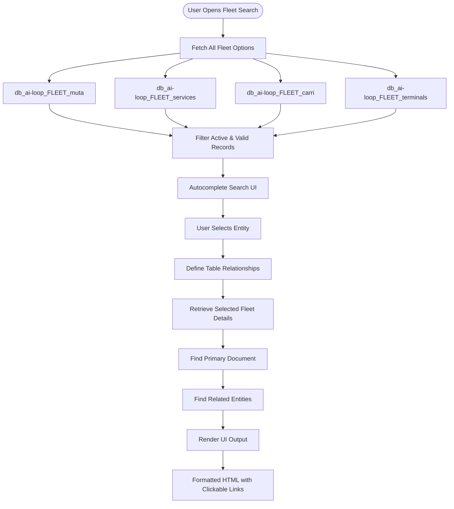

The **Fleet Search** system enables real-time search and interactive visualization of fleet data, showing detailed information and relationships for railway wagons, terminals, or services. The system provides intelligent autocomplete search across multiple fleet databases and displays interconnected data through clickable relationship links.

## Workflow Visualization

## Fleet Databases

The system searches across multiple fleet-related databases:

- **`db_ai-loop_FLEET_muta`**: Fleet circulation/rotation data with relationships to railway wagons
- **`db_ai-loop_FLEET_services`**: Service definitions and configurations
- **`db_ai-loop_FLEET_carri`**: Railway wagon inventory (identified by `NUMEROVAGONE`)
- **`db_ai-loop_FLEET_terminals`**: Terminal locations and allocations

<Frame caption="Fleet Search interface with autocomplete search and detailed entity view.">
  
</Frame>

[Open Fleet Search →](https://ai-loop.alpeadria.com/ai-loop/flows?flow=searchview&command=search&search=)

## Search Workflow

The fleet search operates through a two-command workflow:

### 1. Main Command - Search Interface

When users access the fleet search feature, the **main command** executes:

- **Fetch Searchable Options**: Queries all four fleet databases to build a comprehensive search index
- **Active & Valid Filtering**: Only includes records where:
  - `active = "TRUE"`
  - `valid_until` is empty, missing, or set to "NOW"
- **Autocomplete Creation**: Generates a searchable dropdown with all available fleet entities
- **Search UI Display**: Returns an interactive search interface with autocomplete suggestions

### 2. Search Command - Detail Retrieval

When users select an item from the search, the **search command** executes:

- **Relationship Mapping**: Defines relationships between fleet collections:
  - **Muta → Carri**: Links circulation data to specific railway wagons
  - **Terminals → Terminal Allocation**: Connects terminals to their allocations
  - **Terminal Allocation → Muta**: Links allocations back to circulation data
  
- **Primary Document Retrieval**: Fetches the selected entity's complete details from the database

- **Related Entity Discovery**: Automatically finds connected data:
  - Parses comma-separated relationship fields
  - Retrieves related documents from connected collections
  - Builds a relationship graph for navigation

- **HTML Rendering**: Generates a formatted output with:
  - Clean, professional styling
  - Grid-based detail display with labels and values
  - **Clickable relationship links**: Navigate to related entities with a single click
  - Timestamp formatting for date fields
  - Boolean value highlighting (TRUE in green, FALSE in red)

## Key Features

### Intelligent Search

- **Multi-Database Search**: Searches across all fleet databases simultaneously
- **Real-Time Autocomplete**: Instant suggestions as users type
- **Active Record Filtering**: Only shows currently valid and active fleet data

### Relationship Navigation

The system automatically discovers and displays relationships between fleet entities:

- **Muta ↔ Carri**: View which wagons are part of a circulation
- **Terminals ↔ Allocations**: See terminal allocation details
- **Cross-Collection Links**: Navigate seamlessly between related data

Each related entity appears as a clickable link that triggers a new search, enabling users to explore the entire fleet data graph interactively.

### Professional UI Output

- **Formatted Labels**: Automatically formats database field names into readable labels
- **Data Type Detection**: Recognizes and formats timestamps, booleans, and links
- **Responsive Grid Layout**: Clean, organized display of all entity details
- **Visual Indicators**: Color-coded status values for quick scanning

## Flow Execution

<Steps>
  <Step>
    ### 1. User Initiates Search
    User accesses the Fleet Search feature, triggering the **main** command.
    
    **Action**: System queries all fleet databases and builds the autocomplete search index.
    
    **Output**: Interactive search UI with dropdown autocomplete containing all fleet entities.
  </Step>

  <Step>
    ### 2. User Selects Entity
    User types or selects a specific fleet entity (wagon, terminal, service, or muta).
    
    **Input Example**: User selects wagon "NUMEROVAGONE: 83123456"
    
    **Action**: Triggers the **search** command with the selected entity details.
  </Step>

  <Step>
    ### 3. System Retrieves Details
    Backend processes the search request:
    
    - Loads relationship configuration
    - Queries the primary database for the selected entity
    - Discovers related entities through foreign key relationships
    - Fetches details of all related entities
  </Step>

  <Step>
    ### 4. Render Interactive Output
    System generates HTML response:
    
    - Displays all entity details in a formatted grid
    - Creates clickable links for related entities
    - Applies styling and formatting rules
    - Returns the complete HTML to the user interface
    
    **Result**: User sees a detailed view with navigation links to explore related data.
  </Step>
</Steps>

## Example Use Cases

### Viewing Wagon Details
1. User searches for wagon number "83123456"
2. System displays wagon details (type, status, allocation)
3. User clicks on related "muta" link
4. System shows the circulation this wagon is part of

### Exploring Terminal Allocations
1. User searches for terminal "Terminal Milano"
2. System displays terminal details and location
3. Shows related terminal allocations as clickable links
4. User can navigate to see which muta/services are allocated to this terminal

### Service Investigation
1. User searches for a service by name
2. System displays service configuration
3. Shows any related terminals or wagons
4. Enables full traceability of service deployment
