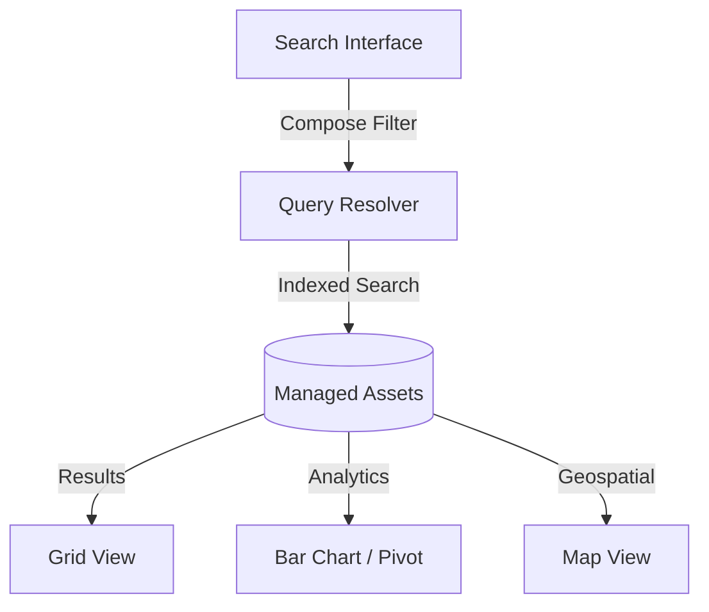

## 1. Overview
**Search and View** is the high-performance search engine designed for rapid asset discovery. In a fleet of thousands of wagons distributed across a continent, operators need a powerful query tool to slice and dice the data instantly.

## 2. Fleet Query Workflow

## 3. Advanced Filtering Capability
Users can construct complex boolean queries using a dedicated filter sidebar:

### Technical & Operational Filters
*   **Technicals**: Filter by `Modello`, `Caratteristiche` (GPS, Brake Blocks), or `Revision Deadline`.
*   **Operations**: Filter by `Stato` (Available, Damaged), `Location` (Node), or `Keeper` (VKM).

## 4. Bulk Operations & Analysis
The search results grid allows for mass-actions, significantly reducing manual data entry:

*   **Bulk Status Change**: Updating operational states for multiple assets in a single transaction.
*   **Export**: Full Excel extraction of the currently filtered set for offline auditing.

### Visual Analytics (View By)
The **View By** feature generates a **bar chart** that groups fleet data by a selected attribute (e.g., Modello, Stato, Nodo) and displays the count per group.

## 5. Navigation
*   **Menu Path**: `Fleet_V2 > Search and View`
*   **Performance**: Optimized for sub-200ms discovery across continental fleets.
