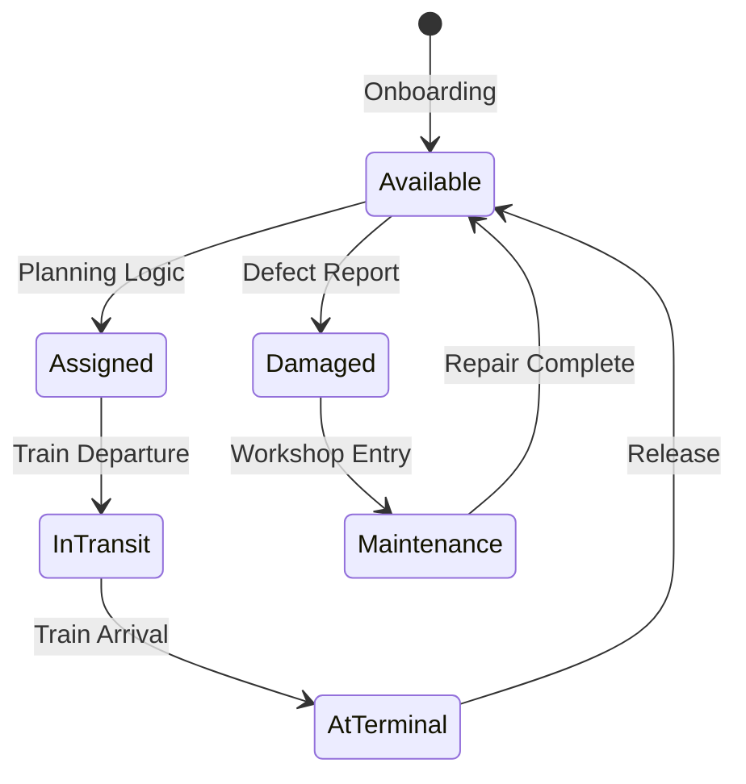

## 1. Overview
**Stato Carri** (Wagon Status) is the operational control tower for the fleet. While *Flotta Carri* defines the asset, *Stato Carri* tracks its dynamic reality. It provides real-time visibility into availability, location, and mechanical condition and captures the lifecycle of one asset.

## 2. Maintenance Lifecycle

## 3. Status States

### Operational States
*   **AVAILABLE**: The wagon is technically sound and ready for assignment.
*   **ASSIGNED**: The wagon is linked to a planned train journey.
*   **IN-TRANSIT**: The wagon is currently moving on an active train.
*   **AT-TERMINAL**: The wagon is dwelling at a specific network node.

### Non-Operational States
*   **MAINTENANCE**: The wagon is in a workshop (Officina) and unavailable for planning.
*   **DAMAGED (Guasto)**: The wagon has a reported defect but is not yet in a workshop.
*   **STORED (Accantonato)**: The wagon is parked long-term.

## 4. Key Functionalities

### The "Traffic Light" Dashboard
The interface uses a rigorous color-coding system for instant situational awareness:
*   **GREEN**: Available & Clean.
*   **YELLOW**: Available but nearing maintenance deadline (< 30 days).
*   **RED**: Unavailable (Maintenance/Damaged).

### Maintenance Workflow
1.  **Defect Reporting**: Operational staff flag a wagon as "Damaged" upon inspection.
2.  **Status Update**: System automatically flips status to `DAMAGED` and removes it from available stock.
3.  **Workshop Routing**: Fleet Manager generates a "Repair Order" sending the wagon to a specific Workshop Node.

### Location Tracking
The system updates the wagon's location automatically based on Execution events:
*   **Train Arrival**: Updates location to the Arrival Terminal.
*   **Train Departure**: Updates location to "On Train [Train Number]".

## 5. View By — Fleet Distribution Analysis

Stato Carri has two main views, selectable via tabs at the top of the page:

| Tab | Purpose |
| :--- | :--- |
| **View by** | Generates a bar chart grouping wagons by a selected attribute. |
| **Summary** | A numeric summary table of the same data. |

## 6. Navigation
*   **Menu Path**: `Fleet_V1 > Stato Carri`

