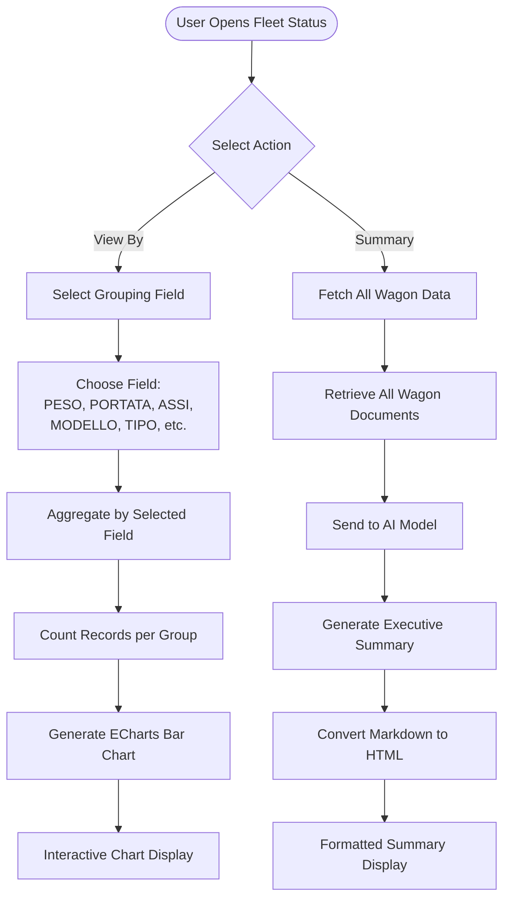

The **Stato Carri** system provides powerful tools for analyzing and summarizing railway wagon data. Users can generate interactive bar charts grouped by any wagon attribute or create comprehensive AI-powered executive summaries of the entire fleet.

## Workflow Visualization

## Key Features

### 1. View By - Interactive Data Visualization

Generate dynamic bar charts to visualize wagon distribution across any attribute:

**Available Grouping Fields**:
- **PESO**: Weight distribution
- **PORTATA**: Capacity grouping
- **ASSI**: Axle configuration
- **LUNGHEZZA**: Length categories
- **MODELLO**: Model types
- **TIPO**: Wagon types
- **FORNITORE**: Supplier distribution
- **Wagon_Keeper**: Keeper assignments
- **POSIZIONE**: Current positions

**Chart Features**:
- Interactive ECharts-powered visualization
- Automatic count aggregation per group
- Professional styling with customizable colors
- Responsive design with tooltips
- Clear axis labels and title

<Frame caption="Interactive bar chart showing wagon distribution grouped by selected field.">
  
</Frame>

[Open View By Chart →](https://ai-loop.alpeadria.com/ai-loop/flows?flow=stato-carri&command=view-by&View_by=)

### 2. Summary - AI-Powered Fleet Analysis

Generate comprehensive executive summaries using AI analysis:

**Summary Includes**:
- Total number of wagons (owned vs. managed breakdown)
- Complete list of wagon IDs (NUMEROVAGONE)
- Key operational details for each wagon
- Critical patterns and upcoming deadlines
- Management-relevant insights

**AI Processing**:
- Analyzes all wagon documents from `db_ai-loop_FLEET_carri`
- Extracts critical fields: ECM, ASSI, PESO, TIPO, MODELLO, PORTATA, contract details, and more
- Generates concise, professional summaries for quick decision-making
- Identifies time-sensitive information relative to current date

<Frame caption="AI-generated executive summary of fleet status with key insights.">
  
</Frame>

## Workflow Details

<Steps>
  <Step>
    ### 1. User Selects Action
    User accesses the Fleet Status feature and chooses between:
    - **View By**: Generate visual charts
    - **Summary**: Get AI-powered analysis
  </Step>

  <Step>
    ### 2a. View By - Chart Generation
    
    **User Action**: Select a field to group by (e.g., "TIPO" for wagon types)
    
    **System Process**:
    1. Queries `db_ai-loop_FLEET_carri` collection
    2. Performs MongoDB aggregation: groups by selected field and counts records
    3. Sorts results by field value
    4. Generates ECharts configuration with:
       - X-axis: Field values (wagon types, models, etc.)
       - Y-axis: Count of wagons
       - Title: "Distribuzione dei carri per [Field]"
    5. Returns interactive HTML chart
    
    **Output**: Interactive bar chart showing distribution of wagons across the selected attribute
  </Step>

  <Step>
    ### 2b. Summary - AI Analysis
    
    **System Process**:
    1. Fetches all documents from `db_ai-loop_FLEET_carri` with projection:
       - Wagon identifiers: NUMEROVAGONE, ECM
       - Physical attributes: ASSI, PESO, TIPO, MODELLO, PORTATA, LUNGHEZZA
       - Operational data: POSIZIONE, monitoring, Wagon_Keeper
       - Contract info: FORNITORE, Rif_Contratto, INIZIO_NOLEGGIO, Termine_Disdetta
       - Maintenance: Scadenza, KM_rimanenti, Eventuali_limitazioni_Km
       - Special equipment: Special_Equipment_POWER_BOX, Special_Equipment_ALTRO
    
    2. Sends data to AI with specialized logistics prompt
    3. AI analyzes and generates summary covering:
       - Total wagon count (owned vs. managed)
       - Wagon IDs and key details
       - Critical patterns and deadlines
    
    4. Converts markdown response to HTML
    5. Returns formatted executive summary
    
    **Output**: Professional HTML summary ready for management review
  </Step>

  <Step>
    ### 3. Display Results
    
    - **Charts**: Rendered in browser with full interactivity (hover tooltips, zoom, etc.)
    - **Summary**: Displayed as formatted HTML with proper headings and structure
    - Both outputs are optimized for quick scanning and decision-making
  </Step>
</Steps>

## Use Cases

### Operations Management
- **Quick Distribution Check**: Use "View By TIPO" to see wagon type distribution
- **Supplier Analysis**: Group by "FORNITORE" to analyze supplier allocation
- **Location Overview**: View by "POSIZIONE" to understand fleet positioning

### Executive Reporting
- **Fleet Status Report**: Generate AI summary for weekly management meetings
- **Contract Review**: Summary highlights upcoming contract deadlines and renewal dates
- **Maintenance Planning**: AI identifies wagons approaching service limits

### Strategic Planning
- **Capacity Analysis**: View by "PORTATA" to understand capacity distribution
- **Model Assessment**: Group by "MODELLO" to analyze fleet composition
- **Keeper Allocation**: View by "Wagon_Keeper" to review keeper assignments
