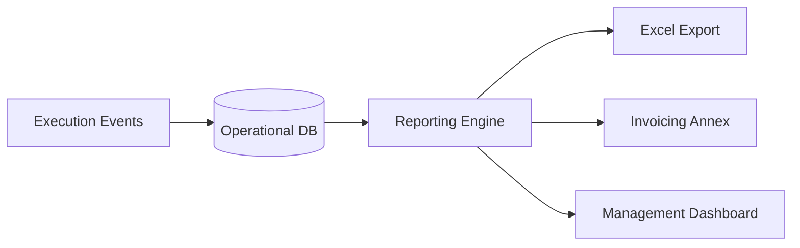

## 1. Overview
The reporting engine provides deep insights into the database using predefined templates for common logistics KPIs. It transforms raw operational events into structured data for client billing, carrier auditing, and management oversight.

## 2. Technical Field Mapping (Report Soste)
The **Soste** (Storage) report is the primary tool for administrative terminal validation.

| Field | Source | Description |
| :--- | :--- | :--- |
| **Codice UTI** | Inventory | The physical unit identification. |
| **Sosta (GG/HH)** | Calculation | Duration between Gate-In and Gate-Out. |
| **Inizio / Fine Sosta**| Monitoring | The validated timestamps of entry and exit. |
| **Validato Il** | Manual | Administrative audit timestamp. |

## 3. Core Report Catalog

### Report Generale Treni
Monitoring of train journeys and capacity utilization.
*   **Fields**: Viaggio ID, ETD/ATD variance, Load Factor %, Total Weight.
*   **Purpose**: Rail network optimization and carrier SLA verification.

### Report Autotrasportatori
Tracking of road transport missions.
*   **Fields**: Hauler Name, Mission Status, Actual Pick-up/Delivery times.
*   **Purpose**: Performance auditing of external trucking partners.

### Report Clienti
Detailed tracking of individual customer bookings.
*   **Fields**: Booking Ref, Merchandise Type, HS Code, Total TEU.

## 4. Reporting Architecture

### Capabilities
*   **Batch Save**: Operators can perform inline validation of records (e.g., checking storage days) and commit changes in bulk using the **Salva dati report** function.
*   **Recalculation**: The **Ricalcola** button allows for a manual refresh of the calculation engine if timestamps are corrected after the event.
*   **Data Consistency**: All filters are dynamically linked to the **GENERALE** module master registries, ensuring that reports stay aligned with current subjects and nodes.
