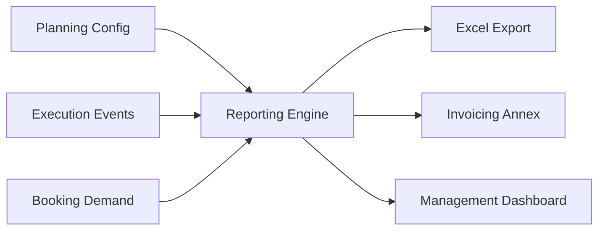

## 1. Overview
The reporting engine provides deep insights into the database using predefined templates for common logistics KPIs. It transforms raw operational events into structured data for client billing, carrier auditing, and management oversight.

## 2. Technical Field Mapping (Intelligence & Sources)
The reporting engine is a cross-modular aggregator. Every field is a dynamic pointer to the master or operational databases.

| Field Label | Technical ID | Primary Source | Flow Logic |
| :--- | :--- | :--- | :--- |
| **Cliente** | `id_cliente` | **GENERALE > Soggetti** | Filtered by Role: *Cliente*. |
| **Connessione** | `id_connessione` | **DESIGN > Connessioni**| Links report to a specific route. |
| **Tipo UTI** | `id_tipo_uti` | **GENERALE > UTI** | Aggregates volume by equipment class. |
| **Tonnellaggio** | `peso_netto` | **BOOKING** | Sum of net weights of loaded units. |
| **Status** | `stato_inv` | **System State** | Current commercial state (Planned, Invoiced). |

## 3. Core Report Catalog

### Report Tonnage & Volumes
Aggregates the physical throughput of the network.
*   **KPIs**: Total TEU, Net Tonnes vs Gross Tonnes.
*   **Source**: Pulled from the `bookings` table, filtered by confirmed `id_viaggio`.

### Report Autotrasportatori (Trucking)
Performance auditing of external trucking partners.
*   **Fields**: Hauler Name (`id_vettore`), Mission Status, ATD/ATA variance.
*   **Purpose**: Tracking first/last mile efficiency.

### Report Soste (Storage & Demurrage)
Calculates terminal occupancy for billing accessory services.
*   **Logic**: `Gate-In Time` - `Gate-Out Time`.
*   **Critical Node**: Must be linked to a **Node** in the registry marked with `is_terminal=1`.

## 4. Reporting Architecture & Propagation

### Advanced Functionalities
*   **Batch Integrity**: Operators use the **Salva dati report** function to "freeze" a report for a specific period, preventing future operational changes from altering historical financial figures.
*   **Dynamic Recalculation**: If a terminal mistake is corrected in the **Execution** module (e.g., wrong Gate-In date), the **Ricalcola** button in Admin re-runs the storage cost engine instantly.
*   **Role-Based Visibility**: Visibility into "Fatturazione" (Billing) fields is restricted to users with administrative privileges defined in the global configuration.
