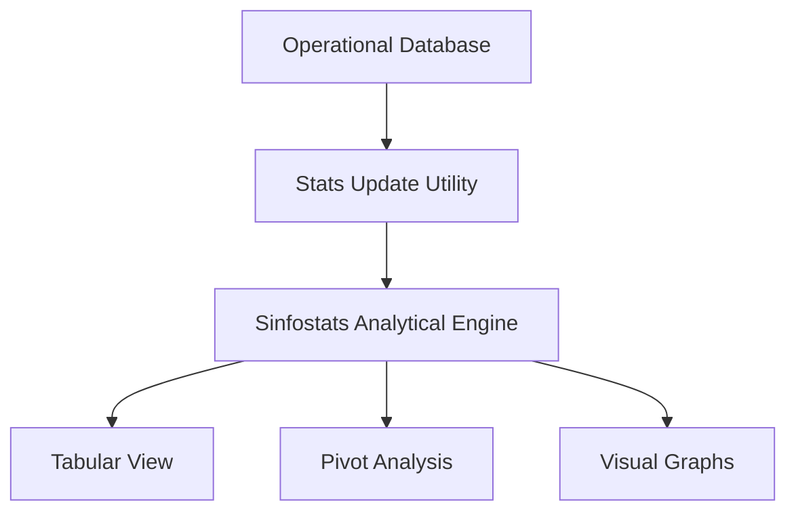

## 1. Overview
The **Statistics Panel** is a specialized analytical portal designed for executive oversight. It provides a visual and multi-dimensional view of the platform's throughput, equipment utilization, and operational trends.

## 2. Technical Scope (Tren-Stats Dashboard)
The statistical engine aggregates data across three primary viewing modes: **Table**, **Analysis (Pivot)**, and **Graphs**.

### Key Statistical Parameters
| Category | Metric | Focus |
| :--- | :--- | :--- |
| **Train Performance** | `Load Factor` | % of wagon capacity utilized per voyage. |
| **Wagon Utilization** | `Net/Gross Weight`| Total tonnage carried by specific wagon types. |
| **Equipment Flow** | `TEUs tot.` | Volume monitoring of intermodal unit movements. |
| **Timeliness** | `Delay Analytics` | Variance analysis of ETD vs. ATD across routes. |

## 3. Data Processing Workflow

### Real-Time Update Model
Operational changes are not instantly reflected in the Statistics portal to ensure system performance. Instead:
1.  **Event Capture**: Events are recorded in the main TMS database.
2.  **Manual/Scheduled Trigger**: The **Aggiornamento Statistiche** toggle is used to push the latest records to the analytical hub.
3.  **Engine Processing**: The `Sinfostats` engine recalculates the aggregate weights, TEUs, and pivot cubes for consumption.

## 4. Analytical Capabilities
*   **Wagon Status Audit**: Granular tracking of unique wagon IDs (`Matricola`) to identify under-performing assets.
*   **Service Trend Analysis**: Filtering metrics by `Servizio` or `Connessione` to evaluate the profitability of specific logistical routes.
*   **Directional Flow**: Comparative analysis of Import vs. Export volumes at specific terminals.
