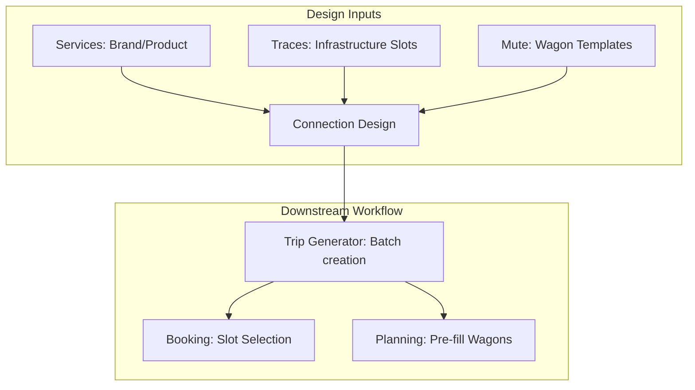

## 1. Overview
**Connections** (Connessioni) are the logical "glue" that links commercial **Services** to physical **Traces**. They define the network topology, including specific paths, transit times, and critical operational handovers (Ready/HO times) between stakeholders.

## 2. Technical Field Mapping

### Testata (Connection Header)
Defines the high-level routing and service association.

| Field | Source | HTML Name | Description |
| :--- | :--- | :--- | :--- |
| **Servizio** | `js-servizi` | `id_servizio` | Associated commercial service. |
| **Origine / Dest.** | `js-nodes` | `luogo_partenza/arrivo` | Fixed endpoints for the connection. |
| **Via** | `js-nodes` | `luogo_via` | Mandatory transit node (optional). |
| **Spot** | Static | `spot` | Flag for non-regular ad-hoc services. |

### Relazioni (Segments & Handovers)
Connections define a rigorous timeline for intermodal handovers. All fields are **Time** inputs.

| Handover Type | HTML Name | Description |
| :--- | :--- | :--- |
| **Booking Cut Off** | `relazione_booking_cutoff` | Deadline for order entry. |
| **MAD IF** | `relazione_..._mad_shunting_railway_company`| Ready for Railway Co. |
| **HLR IF** | `relazione_..._hlr_railway_company` | Handed over to Railway Co. |
| **MAD Terminal** | `relazione_..._mad_shunting_terminal` | Ready for Terminal handling. |

### Connection Segment Interface
The interface below illustrates the technical configuration of a **Railway Relation**, including handover timelines, rolling stock (Muta Carri), and commitment parties.

<Frame caption="Interface for defining a Railway Relation (Relazione Ferroviaria).">
  
</Frame>

## 3. Operational Handover Logic
A **Connection** is the technical blueprint that ensures commercial promises (Services) are technically feasible.

### I. The Handover Timeline (MAD/HLR)
The system enforces a rigorous timeline for intermodal responsibility:
- **MAD (Messa a Disposizione)**: The timestamp when the cargo is physically ready at the terminal for the railway company.
- **HLR (Handed Over)**: The timestamp when legal and physical custody is transferred to the Carrier.
- **Logic**: These times are used in the **Execution** module to generate the "Ready-to-Load" alerts for terminal operators.

### II. Rolling Stock Integration
Connections link specific **Rolling Stock Models** (Mute Carri) to a route. When a trip is generated from this connection, the system automatically pre-populates the **Rail Planning** "Tetris" view with these specific technical wagons, reducing manual effort for planners.

## 4. Connectivity Matrix & Propagation

### Inbound Dependencies
*   **Services Module**: Links the route to a commercial offering (e.g., "Bavaria Express").
*   **Traces Module**: Links the logical connection to physical train numbers and Infrastructure Manager (IM) paths.

### Outbound Impact
- **Trip Generator**: This is the primary input for the batch generation tool. Without a valid Connection, no operational `Viaggio` (Trip) can be instantiated.
- **SLA Monitoring**: The MAD/HLR baseline defined here is compared against live timestamps in the **Admin & Reports** module to calculate carrier performance KPIs (Service Level Agreements).
