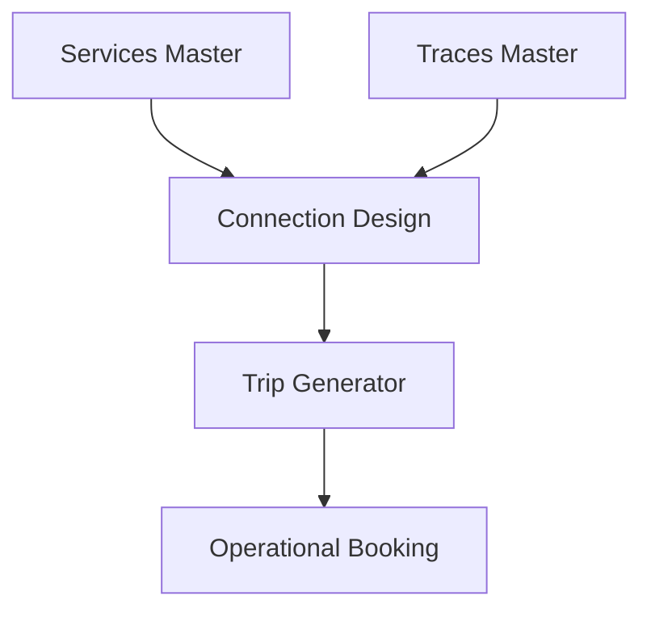

## 1. Overview
**Connections** (Connessioni) are the logical "glue" that links commercial **Services** to physical **Traces**. They define the network topology, including specific paths, transit times, and critical operational handovers (Ready/HO times) between stakeholders.

## 2. Technical Field Mapping

### Testata (Connection Header)
Defines the high-level routing and service association.

| Field | Source | HTML Name | Description |
| :--- | :--- | :--- | :--- |
| **Servizio** | `js-servizi` | `id_servizio` | Associated commercial service. |
| **Origine / Dest.** | `js-nodes` | `luogo_partenza/arrivo` | Fixed endpoints for the connection. |
| **Via** | `js-nodes` | `luogo_via` | Mandatory transit node (optional). |
| **Spot** | Static | `spot` | Flag for non-regular ad-hoc services. |

### Relazioni (Segments & Handovers)
Connections define a rigorous timeline for intermodal handovers. All fields are **Time** inputs.

| Handover Type | HTML Name | Description |
| :--- | :--- | :--- |
| **Booking Cut Off** | `relazione_booking_cutoff` | Deadline for order entry. |
| **MAD IF** | `relazione_..._mad_shunting_railway_company`| Ready for Railway Co. |
| **HLR IF** | `relazione_..._hlr_railway_company` | Handed over to Railway Co. |
| **MAD Terminal** | `relazione_..._mad_shunting_terminal` | Ready for Terminal handling. |

### Connection Segment Interface
The interface below illustrates the technical configuration of a **Railway Relation**, including handover timelines, rolling stock (Muta Carri), and commitment parties.

<Frame caption="Interface for defining a Railway Relation (Relazione Ferroviaria).">
  
</Frame>

## 3. Rolling Stock & Transit
Connections allow for the default configuration of the train model.
*   **Composizione Muta**: Linking a default set of wagons (`js-mute`) to the connection.
*   **Nodi Transito**: A sequental list of intermediate stations, including **Border Crossing** (Confine) flags and UIC Route codes.

## 4. Connectivity Matrix

*   **Inbound**: Pulls O/D nodes from the **General Module** and path numbers from **Railway Traces**.
*   **Outbound**: Directly feeds the **Trip Generator** (Generatore Viaggi). When a user creates a booking, the system uses these connection templates to calculate feasible routes and transit times.
*   **Operational Control**: The handover times (MAD/HLR) defined here are used as the baseline for "Planned vs. Actual" performance monitoring in the **Execution** and **Admin** modules.
