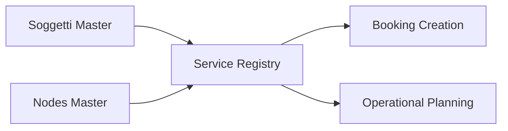

## 1. Overview
The **Services** (Servizi) registry is the central management interface for defining the commercial offerings of the logistics network. It serves as the primary lookup for the **Booking** module, ensuring that every order is linked to a valid, commercially authorized transport path.

## 2. Technical Field Mapping

### List View (Gestione Servizi)
The registry provides a searchable grid of all defined services, highlighting their operational status and validity periods.

| Field | Source | Description |
| :--- | :--- | :--- |
| **Denominazione** | `denominazione` | The commercial name of the service. |
| **Codice** | `codice` | Unique internal identifier. |
| **Tipo Servizio** | `id_tipo_servizio`| Categorization (e.g., Terminal-to-Terminal, Door-to-Door). |
| **Validità** | `data_da` / `data_a` | The active date range for the service. |

### Configuration Form (Add/Edit)
The configuration is divided into functional sections to handle both operational and administrative metadata.

| Section | Field | HTML Name | Purpose |
| :--- | :--- | :--- | :--- |
| **Generale** | **Tipo trasporto** | `id_tipo_trasporto` | Defines mode (Rail, Road, Maritime). |
| **Generale** | **Tipo servizio** | `id_tipo_servizio` | Multi-select for service categories. |
| **Parametri PCS**| **Terminal Partenza**| `terminal_pcs_partenza`| External reference for port systems. |
| **Caratteristiche**| **Operativo** | `operativo` | Toggles visibility in Execution. |
| **Amministrazione**| **Fatturazione** | `fatturazione` | Controls automated billing logic. |

## 3. Data Connectivity

### Inbound Dependencies
*   **Subjects Registry**: Services are linked to specific MTOs and Vettori.
*   **Nodes Registry**: Departure and arrival terminals must be pre-defined as valid network nodes.

### Outbound Impact
*   **Booking Lookup**: When a user creates a new transport request, they first select a **Service**, which then filters valid O/D pairs and transport rules.
*   **Financial Tracking**: The "Fatturazione" (Billing) toggle handles how costs and revenues are aggregated in the **Admin & Reports** module.

## 4. Operational Lifecycle
Services are maintained in an `Attivo` or `Inattivo` state. A service can only be utilized for new bookings if it falls within its defined validity date range and is marked as active in the system.
