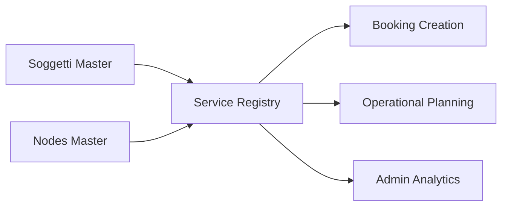

## 1. Overview
The **Services** (Servizi) registry is the central management interface for defining the commercial offerings of the logistics network. It serves as the primary lookup for the **Booking** module, ensuring that every order is linked to a valid, commercially authorized transport path.

## 2. Technical Field Mapping
The Services registry pulls data from either global enums or core system configurations to ensure consistency across the design phase.

### List View (Gestione Servizi)
The registry provides a searchable grid of all defined services.
- **Search Logic**: Free-text search on `denominazione` and `codice_servizio`.
- **Primary Key**: Each row is a primary key (`id_servizio`) used as a foreign key throughout the **DESIGN** and **PLANNING** modules.

| Field | Source | Description |
| :--- | :--- | :--- |
| **Denominazione** | `denominazione` | The commercial name of the service. |
| **Codice** | `codice` | Unique internal identifier. |
| **Tipo Servizio** | `id_tipo_servizio`| Categorization (e.g., Terminal-to-Terminal, Door-to-Door). |
| **Validità** | `data_da` / `data_a` | The active date range for the service. |

### Configuration Form (Add/Edit)
These fields define the operational and commercial boundaries of the offering.

| Field Label | Technical Name | Source Data (ID) | Origin | Flow/Logic |
| :--- | :--- | :--- | :--- | :--- |
| **Tipo servizio** | `id_tipo_servizio` | `tipi_servizio` | Enum | Defines the operational model (Commercial vs Technical). |
| **Tipo trasporto** | `id_tipo_trasporto` | `tipi_trasporto` | Enum | Determines which assets (Wagons/UTI) are valid. |
| **Operativo** | `operativo` | Checkbox | Manual | Toggles visibility in Execution modules. |
| **Fatturazione** | `fatturazione` | Checkbox | Manual | Controls automated billing logic in Admin. |

## 3. Propagation & Data Connectivity
Once a Service is defined, it becomes a **Source of Truth** for the entire logistics lifecycle.

| Target Module | Dynamic Field | Usage |
| :--- | :--- | :--- |
| **DESIGN > Connessioni** | `Servizio di rif.` | Links a physical route to this commercial service. |
| **BOOKING > Nuovo** | `Servizio` | The primary selector for starting a new transport mandate. |
| **ADMIN > Reports** | `Filtro Servizio`| Used to aggregate tonnage and revenue by service name. |

### Inbound Dependencies
*   **Subjects Registry**: Services are linked to specific MTOs and Carriers.
*   **Nodes Registry**: Departure and arrival terminals must be pre-defined as valid network nodes.

## 4. Operational Lifecycle
Services are maintained in an `Attivo` or `Inattivo` state. A service can only be utilized for new bookings if it falls within its defined validity date range and is marked as active in the system.
