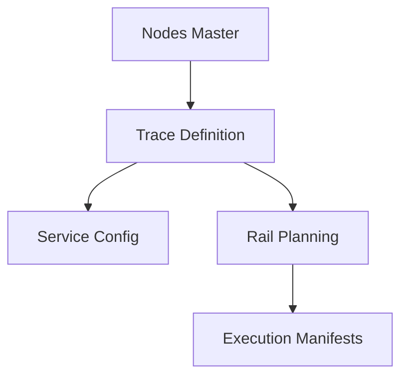

## 1. Overview
**Railway Traces** (Tracce) are the technical building blocks for rail transport planning. While a Service is a commercial product, a Trace represents the physical "slot" on the rail infrastructure, including its schedule, carrier, and technical limits.

## 2. Technical Field Mapping

### List View (Gestione Tracce)
The list view identifies available paths and their primary technical stakeholders.

| Field | Source | Description |
| :--- | :--- | :--- |
| **Numero** | `numero` | The official train number (Path ID). |
| **Origine / Dest.** | `luogo_partenza` / `_arrivo` | Node identifiers for the train endpoints. |
| **Vettore Ferr.** | `id_vettore_ferroviario`| The traction provider (RU). |
| **Attivo** | `attivo` | Status flag for planning availability. |

### Technical Configuration (Form)
The configuration defines the physical feasibility of the movement.

| Section | Field | HTML Name | Description |
| :--- | :--- | :--- | :--- |
| **Generali** | **Stazione Partenza** | `luogo_partenza` | Autocomplete from Nodes (Rail type). |
| **Generali** | **Vettore Ferr.** | `id_vettore_ferroviario`| Selection from Subjects (Carrier). |
| **Generali** | **Validità Inizio/Fine**| `validita_inizio/fine` | Calendar window for the slot. |
| **Frequenza** | **LUN...DOM** | `lunedi...domenica` | Weekly frequency checkboxes. |
| **Massimali** | **Peso Max.** | `peso_max` | Maximum gross tonnage allowed. |
| **Massimali** | **Lunghezza Max.** | `lunghezza_max` | Maximum train length (meters). |

### Form Interface
The following interface is used for the creation and maintenance of railway traces, capturing technical constraints and circulation frequency.

<Frame caption="Interface for creating a new railway trace (Nuova Traccia).">
  
</Frame>

## 3. Maneuver Logic (Section M53)
The system tracks precise shunting and maneuver timestamps required for train preparation. This is captured in the **M53 Partenza** and **M53 Arrivo** sections.

*   **Inizio/Fine Manovra I & II**: Four distinct time slots per station to capture complex preparation phases (e.g., terminal-to-shunting-yard).
*   **Ora Partenza/Arrivo**: The scheduled "Ready-to-Depart" and "Actual Arrival" timestamps.

## 4. Connectivity & Impact

*   **Inbound**: Traces perform lookups against **Nodes** (of type 'Rail') and **Subjects** (of type 'Carrier').
*   **Outbound (Planning)**: Traces are the core entities used in the **Rail Planning** interface. Planners cannot assign cargo that exceeds the `peso_max` or `lunghezza_max` defined here.
*   **Outbound (Execution)**: The `numero` (Train Number) is used as the primary key for **PCS** (Port Community System) synchronization.
