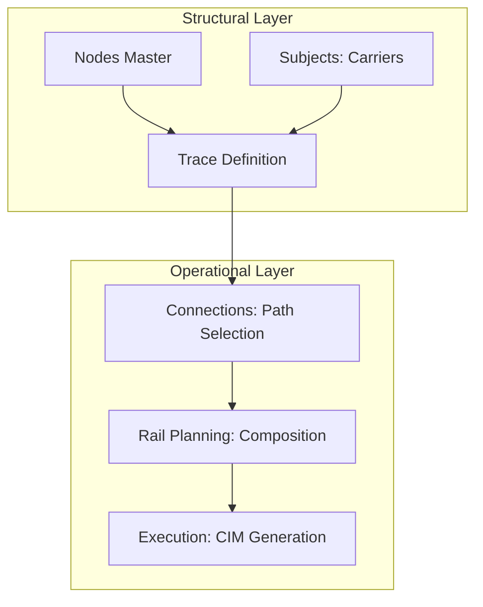

## 1. Overview
**Railway Traces** (Tracce) are the technical building blocks for rail transport planning. While a Service is a commercial product, a Trace represents the physical "slot" on the rail infrastructure, including its schedule, carrier, and technical limits.

## 2. Technical Field Mapping

### List View (Gestione Tracce)
The list view identifies available paths and their primary technical stakeholders.

| Field | Source | Description |
| :--- | :--- | :--- |
| **Numero** | `numero` | The official train number (Path ID). |
| **Origine / Dest.** | `luogo_partenza` / `_arrivo` | Node identifiers for the train endpoints. |
| **Vettore Ferr.** | `id_vettore_ferroviario`| The traction provider (Railway Coach). |
| **Gestore Inf.** | `id_gestore_infrastruttura`| The railway network owner. |
| **Attivo** | `attivo` | Status flag for planning availability. |

### Technical Configuration (Form)
The configuration defines the physical feasibility of the movement.

| Section | Field | HTML Name | Description |
| :--- | :--- | :--- | :--- |
| **Generali** | **Stazione Partenza** | `luogo_partenza` | Autocomplete from Nodes (Rail type). |
| **Generali** | **Vettore Ferr.** | `id_vettore_ferroviario`| Selection from Subjects (Carrier). |
| **Generali** | **Gestore Inf.** | `id_gestore_infrastruttura`| Selection from Subjects (Infrastructure Manager). |
| **Generali** | **Validità Inizio/Fine**| `validita_inizio/fine` | Calendar window for the slot. |
| **Frequenza** | **LUN...DOM** | `lunedi...domenica` | Weekly frequency checkboxes. |
| **Massimali** | **Peso Max.** | `peso_max` | Maximum gross tonnage allowed. |
| **Massimali** | **Lunghezza Max.** | `lunghezza_max` | Maximum train length (meters). |

## 3. Key Stakeholders & Roles
To understand how a Trace works, distinguish between the two primary entities responsible for the journey:

#### I. Vettore Ferroviario (Railway Carrier)
*   **Role**: The "Traction Provider". They own the locomotives and employ the drivers.
*   **Analogy**: Think of them as the **Trucking Company**. They are the ones actually dragging the cargo.
*   **Examples**: Mercitalia, Rail Cargo Austria, Captrain.

#### II. Gestore Infrastruttura (Infrastructure Manager)
*   **Role**: The "Network Owner". They own the physical tracks, the signaling systems, and the electric lines. They grant the "Permission to pass" (the Trace).
*   **Analogy**: Think of them as the **Highway Department**. They provide the road upon which the carrier drives.
*   **Examples**: RFI (Italy), ÖBB-Infrastruktur (Austria), DB Netz (Germany).

## 4. Data Lineage & Persistence
To ensure system-wide integrity, these fields are not free-text; they are linked to verified master data.

| Field | Fetched From (Collection) | Persisted To (Collection) |
| :--- | :--- | :--- |
| **Vettore Ferroviario** | `MAGEMO_CARRIERS_LIST` | `MAGEMO_TRACES_LIST` |
| **Gestore Infrastruttura**| `MAGEMO_MANAGERS_LIST` | `MAGEMO_TRACES_LIST` |

> **Technical Note**: These collections are hosted on the **AI Loop Database**. When a user selects a value in the form, the system stores the unique ID of the record from the source collection into the destination `MAGEMO_TRACES_LIST` collection.

## 5. Form Interface
The following interface is used for the creation and maintenance of railway traces, capturing technical constraints and circulation frequency.

<Frame caption="Interface for creating a new railway trace (Nuova Traccia).">
  
</Frame>

## 3. Operational Logic & Maneuver (Section M53)
Railway Traces are more than just schedules; they are the technical constraints that define the capacity of the rail network.

### I. The Capacity Guardrail
The fields `peso_max` and `lunghezza_max` are physically enforced in the **Planning > Rail** module. 
- **Length Check**: As wagons are added to the consist, the system sums their technical lengths (`anagrafica_carri.lunghezza_fuori_tutto`). If the total exceeds the trace limit, the train is flagged as "Out of Gauge".
- **Weight Check**: The cumulative gross weight of wagons and loaded UTIs is checked against the trace's `peso_max`.

### II. M53 Handover Logic
The system tracks precise shunting and maneuver timestamps required for train preparation. This is captured in the **M53 Partenza** and **M53 Arrivo** sections:
*   **Preparation Phases**: Four distinct time slots per station to capture complex preparation (e.g., terminal-to-shunting-yard).
*   **Operational Ready (OR)**: The timestamp when the train is technically ready for the Infrastructure Manager (IM).

## 4. Connectivity & Propagation

### Inbound Dependencies
*   **Nodes Master**: Traces perform lookups against **Nodes** filtered by type 'Railway Station/Terminal'.
*   **Subjects Registry**: Only subjects tagged with the role **Vettore Ferroviario** can be assigned to a trace.

### Downstream Impact
- **CIM Generation**: The `numero` (Train Number) is a mandatory field in the Rail Consignment Note generated in **Execution**.
- **PCS Handshake**: Technical integration with Port Systems uses the trace's train number as the unique "Arrival/Departure Identifier" for EDI synchronization.
