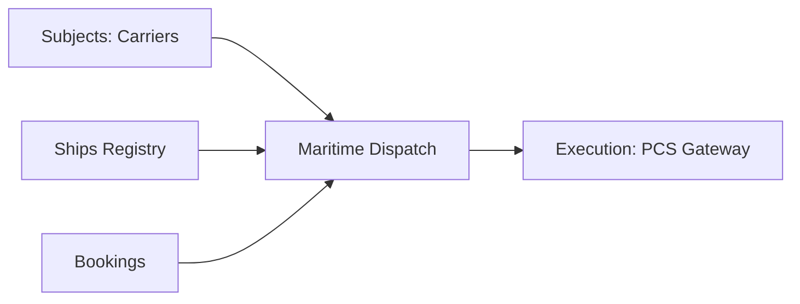

## 1. Overview
The **Maritime Dispatch** module manages the "Sea Leg" of multimodal operations. It handles the synchronization of vessel arrival/departure times, booking closure windows, and customs deadlines.

## 2. Technical Field Mapping (Viaggi Nave)

| Field | Source | HTML Name | Description |
| :--- | :--- | :--- | :--- |
| **Pratica Viaggio** | `MAGEMO_SEA_OPS` | `pratica_viaggio` | Unique Sea-trip reference. |
| **Nome Nave** | `MAGEMO_VESSELS`| `nave` | The technical asset (Ship) identifier. |
| **Chiusura Booking**| Manual | `chiusura_booking` | Hard deadline for accepting new cargo. |
| **Dogana** | Logic | `chiusura_doganale`| Target time for customs documentation completion. |
| **ETA / ATA** | GPS/Manual | `eta` / `ata` | Expected vs Actual Time of Arrival. |
| **ETS / ATS** | GPS/Manual | `ets` / `ats` | Expected vs Actual Time of Sailing. |

## 3. Operational Logic

### Workflow: Vessel Reporting
1.  **Vessel Tracking**: Incoming vessel ETA is updated via port community feeds.
2.  **Manifest Closure**: When the `chiusura_booking` timestamp is reached, the system prevents further assignments.
3.  **Dispatch**: The final manifest is exported and transmitted to the Shipping Line or Terminal Operator.

## 4. Connectivity

### Integration Points
*   **Vessel Registry**: Direct link to `MAGEMO_VESSELS` which stores IMO numbers and DWT capacity.
*   **Port Gateways**: Data flows into the **PCS Gateway** used for digital pre-notifications (COPARN).
