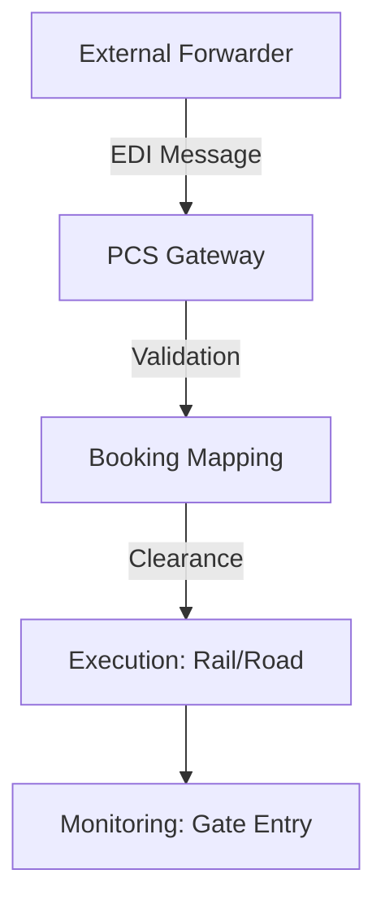

## 1. Overview
The **PCS Gateway** manages the digital exchange of information between the platform and external port authorities. It ensures that all administrative pre-requirements (Customs, EDI, Pre-notifications) are met before the physical execution of a transport leg.

## 2. Technical Field Mapping (Preavvisi PCS)
This interface monitors digital "Pre-notifications" (e.g., COPARN/EDI messages) received from freight forwarders or port systems.

| Field | Source | HTML Name | Description |
| :--- | :--- | :--- | :--- |
| **Pratica** | External | `rif_pcs` | The reference ID from the PCS message. |
| **Codice UTI** | External | `matricola` | The unit serial number declared by the partner. |
| **Transitario** | `js-subjects`| `id_transatario`| The forwarder responsible for the message. |
| **Stato** | Logic | `status_icon` | Validation status (Correct vs. Pending). |

## 3. Core Technical Processes

### EDI Ingestion & Mapping
The system automatically parses incoming EDI messages and attempts to map them to existing **Bookings**.
*   **Assegna (Action)**: Operators can manually link an unassigned PCS message to a specific booking to clear the container for terminal entry.
*   **Customs Clearance**: Real-time monitoring of the "Svincolo" status. A unit is only cleared for "Gate-Out" once the PCS signal indicates no customs hold.

### Web-CIM Infrastructure
For rail movements, the gateway handles the electronic transmission of **CIM** data to the Infrastructure Managers (IM). This ensures that the train manifest is digitally validated before the physical departure.

## 4. Operational Flow

*   **Proactive Alerts**: By monitoring the gateway, operators can identify mismatched "Pre-notifications" days before the physical unit arrives at the terminal, preventing gate congestion.
*   **Paperless Compliance**: Every message processed through the gateway becomes a part of the digital audit trail for the transport mandate.
