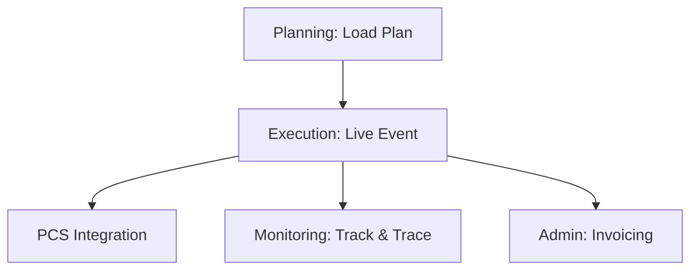

## 1. Overview
The **Rail Operations** sub-module is the operational heart of the Execution module. It manages the physical transition of a train from a "Planned" state to active movement, capturing real-time timestamps and synchronizing with external port systems.

## 2. Technical Field Mapping (Operazioni Rail)

This registry displays all active train voyages in the network.

### Filter & Search
| Label | HTML Name | Description |
| :--- | :--- | :--- |
| **Viaggio Treno** | `codice_pratica` | Search by the unique system voyage ID. |
| **Stato Treno** | `id_stato_treno` | Status filter (e.g., Inviato, Arrivato). |
| **Tr. Iniziale** | `traccia_iniziale`| Search by the technical path number. |

### Operational Grid
| Column | Source | Description |
| :--- | :--- | :--- |
| **VIAGGIO** | `pratica.codice` | Internal voyage identifier. |
| **STATUS** | `stato.descrizione`| Current execution state. |
| **ETD / ETA** | `etd` / `eta` | Scheduled arrival and departure times. |
| **PIENI / VUOTI** | `aggregates` | Real-time count of containers on the train. |

## 3. Operational Events & Manifests
Execution operators use this module to finalize the physical train:
*   **Loading List Detail**: Jumps into the unit-level view to confirm physical container placement.
*   **CIM Generation**: Automated creation of the **Rail Consignment Note** based on the verified wagon consist.
*   **PCS Synchronization**: Technical integration with Port Community Systems to push the manifests to the port terminals.

## 4. Connectivity Flow

*   **Inbound**: Pulls the "Frozen" loading lists from **PLANNING**.
*   **Outbound (Monitoring)**: Every status change (e.g., *Departed*) instantly updates the **Track & Trace** milestone timeline for customers.
*   **Outbound (Finance)**: Weight and wagon data are pushed to **ADMIN & REPORTS** for billing the railway carriers and customers.
