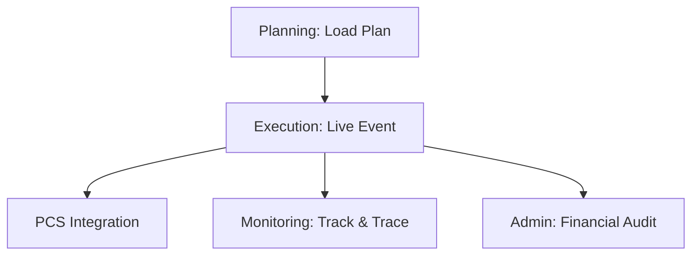

## 1. Overview
The **Rail Operations** sub-module is the operational heart of the Execution module. It manages the physical transition of a train from a "Planned" state to active movement, capturing real-time timestamps and synchronizing with external port systems.

## 2. Technical Field Mapping (Intelligence & Sources)
The rail execution board is a dynamic view of the trip's lifecycle. It pulls data from planning templates and enriches them with live operational telemetry.

### Filter & Search
| Label | Technical ID | Source | Flow Logic |
| :--- | :--- | :--- | :--- |
| **Servizio** | `id_servizio` | **DESIGN** | Filters by commercial service line. |
| **Connessione** | `id_connessione` | **DESIGN** | Filters by specific route template. |
| **Vettore Ferr.**| `id_vettore` | **GENERALE** | Filtered by Role: *Vettore Ferroviario*. |
| **Stato Treno** | `status` | **Config** | Dynamic lifecycle states (Planned, Arrived, etc). |

### Operational Grid
| Column | Source Field | Logic |
| :--- | :--- | :--- |
| **VIAGGIO** | `trip_code` | Unique ID generated in **DESIGN > Generatore**. |
| **ETD / ETA** | `estimated_time`| Pulled from **DESIGN > Tracce**. |
| **PIENI / VUOTI**| `unit_count` | Summary of loaded UTIs from **PLANNING**. |
| **DELAY** | `variance` | Calculated: `Planned Time` vs `Live Timestamp`. |

## 3. Operational Events & Manifests: The Automation Engine
Execution operators use this module to finalize the "Paperless" logistics chain:

- **Activation**: When a trip is activated, the system "Freezes" the loading list. Any further changes must be made via **Operational Overrides**.
- **CIM / Rail Waybill**: The system automatically aggregates the **Subject** (Sender/Receiver), **Wagon** (Technical info), and **Booking** (Cargo info) to generate a legally compliant CIM document.
- **Milestone Handover**: When an operator clicks "Arrivato" (Arrived), the system:
    1. Updates the tracking timeline in **MONITORING**.
    2. Triggers the EDI `COARRI` message to the **PCS**.
    3. Makes the record available for invoicing in **ADMIN**.

## 4. Connectivity Flow

*   **Inbound**: Pulls the "Frozen" loading lists and technical wagon consist from **PLANNING**.
*   **Outbound (Monitoring)**: Every status change instantly updates the **Track & Trace** milestone dashboard.
*   **Outbound (Finance)**: Upon trip closure, validated tonnage data is pushed to **ADMIN & REPORTS** for carrier settlement and customer billing.
