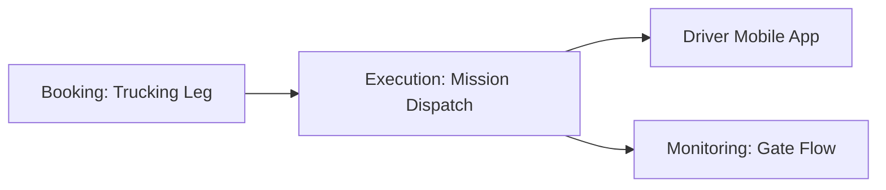

## 1. Road Operations (Trucking)
The **Operazioni Trucking** hub coordinates the first and last-mile pickup and delivery missions. It ensures that the road carriers have all necessary mission details to complete the intermodal chain.

### Technical Field Mapping (Gestione Trasporti)
| Field | Source | HTML Name | Description |
| :--- | :--- | :--- | :--- |
| **Trasportatore**| `js-autocomplete` | `id_vettore` | The assigned road carrier (Subject). |
| **Operazione** | Static | `tipo_op` | Load, Unload, or Equipment Positioning. |
| **Luogo** | `js-nodes` | `id_nodo` | Destination terminal or customer plant. |
| **UTI** | `js-uti` | `uti.matricola` | The physical container being moved. |
| **Mezzo** | Manual | `targa_veicolo` | Truck license plate (if assigned). |

### Driver Interaction & Mobile Sync
Road missions are dispatched directly to the **Alpe Adria Driver App** or through authorized EDI portals.
*   **Nota Autista**: Real-time instructions pushed to the driver's mobile terminal.
*   **Timestamping**: Drivers signal their arrivals and departures via the app, which automatically updates the system's Track & Trace status.

## 2. Maritime Operations
The maritime sub-module manages the feeder and vessel legs of the journey.
*   **Vessel Manifests**: Consolidates all planning data into a single manifest for ship loading.
*   **IMO Synchronization**: Leverages the **Vessel Registry** (Generale) to track specific hull IDs and their linked voyages.

## 3. Data Flow Architecture

*   **Inbound**: Pulls mission details automatically when a **Nuovo Booking** includes a road leg.
*   **Outbound (Operations)**: Dispatched missions populate the "Expected Gate Movements" queue in the **MONITORING** module.
*   **Outbound (Reporting)**: Historical mission data feeds the **Report Autotrasportatori** in the Admin module for carrier performance auditing.
