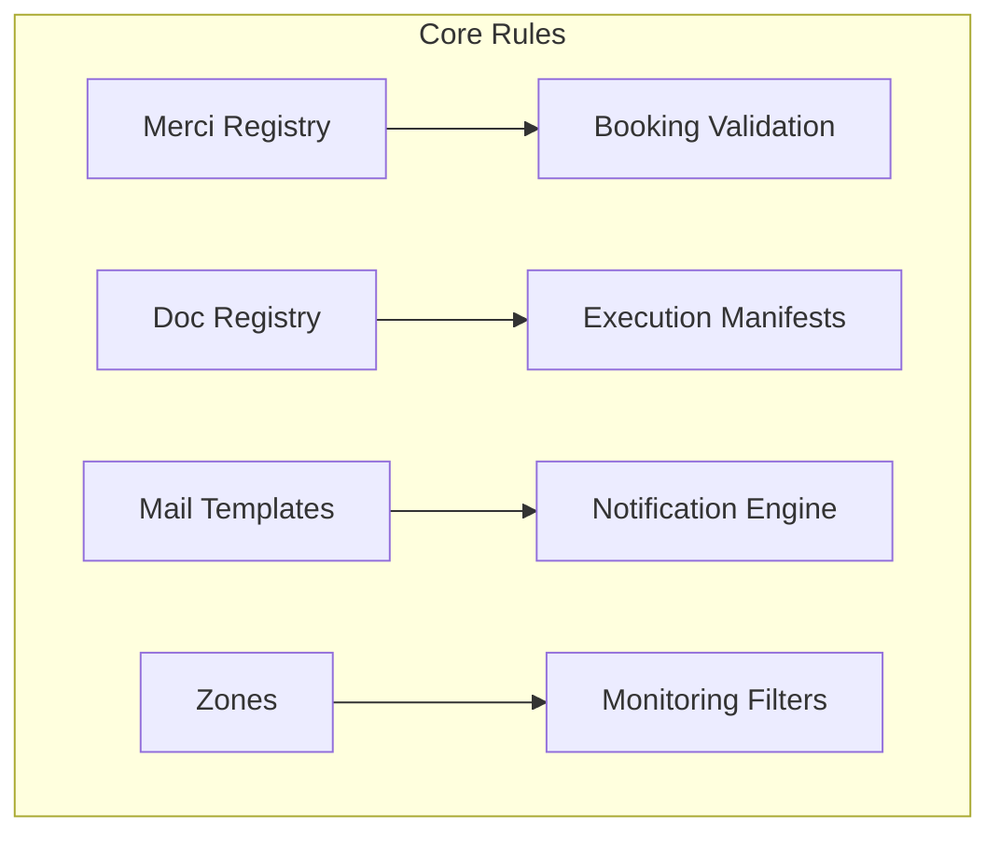

## 1. Overview
The **Configuration** sub-module defines the operational rules, legal classifications, and communication templates used across the platform. This ensures standardization of goods categorization, document compliance, and automated messaging.

## 2. Commodities (Merci)
The official registry of merchandise types. Commodities are selected during the **Booking** phase and are critical for terminal safety and documentation.

### Key Attributes
*   **Codice & Descrizione**: Unique identifier and full commodity name.
*   **Logic Mapping**: Commodities are linked to HS/NHM codes for international rail compliance.
*   **Operational Intent**: Gross weight defined per commodity in a booking drives the entire rail composition planning logic.

## 3. Document Management
Defines the different types of official paperwork handled by the system (e.g., CIM, Manifest, Bill of Lading).

### Technical Mapping
| Field | Technical Name | Description |
| :--- | :--- | :--- |
| **Codice** | `codice` | System ID (e.g., CIM, MRN). |
| **Categoria** | `categoria` | Grouping (Operational, Customs, Financial). |
| **Transito** | `transito` | Flag for shipments requiring customs procedures. |
| **Codici EDI** | `codici_alternativi` | Mapping for external system harmonization (PCS/UIRR). |

## 4. Notification Engine (Mail Config)
Manages the automated outward communication. 

### Mail Templates (Modelli Mail)
The system uses **Trigger Keys (Chiave)** to link templates to operational events.
- **Dynamic Content**: IT/EN/FR localized subjects and bodies with WYSIWYG support.
- **Automated Routing**: Toggles like `invio_ufficio_booking` or `invio_clienti` resolve recipients dynamically based on the transaction.
- **Attachments**: Every template can be configured to automatically attach PDF reports (e.g., Booking List, Loading List, Truck Mandate).

### Mail Parameters
Direct configuration for the SMTP relay and global audit rules (BCC overrides).

## 5. Network Logic (Zones)
Groups Nodes into geographic or operational regions.
*   **Zoning**: Nodes are grouped via `id_zona` to enable corridor-based reporting.
*   **Visibility**: Used for dashboard filtering and role-based data access.

## 6. Connectivity Matrix

