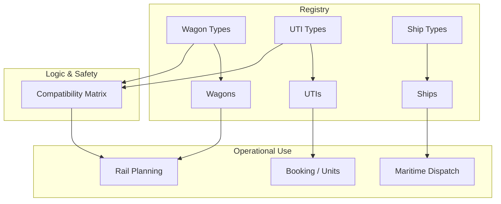

## 1. Overview
The **Equipment** sub-module manages the physical and technical specifications of all transport assets. This includes the rail fleet (Wagons), the intermodal inventory (UTIs), and maritime vessels (Ships). 

These registries define the "Technical Identity" of every asset, providing the constraints (weight, length, capacity) used by the validation engines during **Planning** and **Execution** to ensure safety and operational efficiency.

## 2. Technical Field Mapping (Assets)

### Wagon Registry (Carri)

| Field | Source | HTML Name | Description |
| :--- | :--- | :--- | :--- |
| **Matricola** | Manual/UIC | `matricola` | Unique 12-digit international identifier. |
| **Modello** | Wagon Types | `id_tipo_carro` | Blueprint classification for the asset. |
| **Tara** | Technical | `tara` | Static weight of the empty wagon. |
| **Status** | Logic | `id_stato_carro` | Operational health (Available, Damaged). |

### UTI Registry (Matricole UTI)
| Field | Source | HTML Name | Description |
| :--- | :--- | :--- | :--- |
| **Matricola** | Manual/ISO | `matricola` | Serial number (e.g., MSCU874563). |
| **Tipo UTI** | UTI Types | `id_tipo_uti` | ISO categorization and rail profile. |
| **Proprietario** | Subjects | `id_proprietario` | Legal owner of the equipment. |

## 3. Rail Fleet & Mute
*   **Wagon Types**: The master blueprint defining values like `lunghezza`, `numero_assi`, and `peso_max_carico`.
*   **Mute**: Logical grouping of wagons (Fixed Rakes) that can be assigned to a service in the **DESIGN** module.

## 4. Security & Safety: The Compatibility Matrix
The **Wagon/UTI Compatibility Matrix** is the fundamental rulebook of the system. It explicitly defines the valid loading combinations.

- **Validation Logic**: Planning UI cross-references `id_tipo_carro` vs. `id_tipo_uti`.
- **Positioning**: Defines which "slots" (pins) on the wagon deck can accommodate which container sizes.

## 5. Data Connectivity

