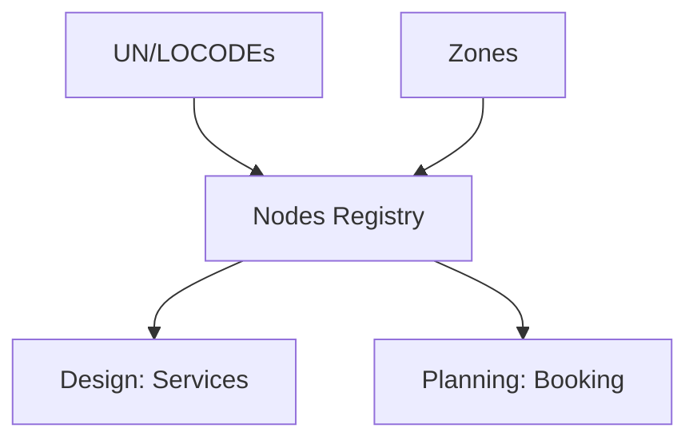

## 1. Overview
The **Locations** registry defines the geographic coordinates and operational boundaries of the network. It translates physical world addresses into logical entities used for routing, tracking, and reporting.

## 2. Technical Field Mapping

### UN/LOCODEs (Località)
The system uses the United Nations Code for Trade and Transport Locations as the primary geographic identifier.

| Field | Source | HTML Name | Description |
| :--- | :--- | :--- | :--- |
| **Località** | `MAGEMO_LOCODES` | `descrizione` | Full name of the city or logistics point. |
| **Codice** | `MAGEMO_LOCODES` | `codice` | 5-character LOCODE (e.g., ITVRN). |
| **Paese** | `MAGEMO_LOCODES` | `paese` | 2-character ISO country code. |
| **Status** | `MAGEMO_LOCODES` | `status` | Active status in the UN database (AI, RL, etc). |

### Zones (Zone)
Zones are logical clusters of **Nodes** used for reporting, security visibility, and operational grouping.

| Field | Source | HTML Name | Description |
| :--- | :--- | :--- | :--- |
| **Descrizione** | `MAGEMO_ZONES` | `descrizione` | The name of the cluster (e.g., Northern Corridor). |
| **Note Operative** | `MAGEMO_ZONES` | `note_operative` | Specific instructions for movements within this zone. |
| **Attivo** | `MAGEMO_ZONES` | `attivo` | Binary toggle (1/0) for system visibility. |

## 3. Data Flow & Connectivity

### Integration Logic
*   **Routing Hierarchy**: A **Node** (e.g., Verona Quadrante Europa) is linked to a **Location** (e.g., Verona ITVRN) which belongs to a **Zone** (e.g., Corridor A).
*   **Filtering**: Search bars throughout the system allow filtering by "Zona" to quickly narrow down a set of terminals or bookings.
