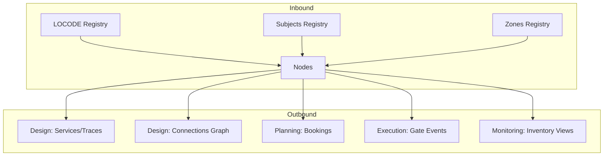

## 1. Overview
The **Nodes** (Nodi) registry defines the physical and logical infrastructure of the network. It includes terminals, railway stations, maritime ports, and warehouses.

Nodes are the foundational building blocks for **Services**, **Traces**, and **Connections**, acting as the start and end points for all logistics movements.

## 2. Core Functional Pillars

### 1. Geo-Location & Identification
Every node is mapped to international and technical standards:
*   **LOCODE**: The UN/LOCODE standard for international shipping, critical for EDI messaging.
*   **UIC Code**: The 5-digit station code for rail operations (Codice UIC).
*   **GPS Coordinates**: Precise Latitude and Longitude for map visualization in tracking modules.

### 2. Node Services (Servizi di nodo)
Defines the operational capabilities of a terminal.
*   **Activity Types**: Shunting, handling, washing, or customs.
*   **Service Providers**: Links specific **Subjects** (Soggetti) as authorized contractors.
*   **Commercial Info**: Stores contract and quotation references to automate cost estimation.

### 3. Network Connectivity (Collegamenti)
Builds the adjacency graph for the routing engine.
*   **Mode-Specific**: Defines links as Road, Rail, or Sea.
*   **Logistics Geometry**: Stores technical distances (km) to calculate trip feasibility and estimated transit times.

### 4. Stakeholder Ownership
Every node is linked to its stakeholders:
*   **Owner (Proprietario)**: The entity that owns the physical infrastructure.
*   **Operator (Gestore)**: The entity responsible for daily operations (Terminal Operator).

## 3. Data Connectivity

## 4. Field Mapping Reference

### Registry View (Gestione Nodi)
| Field | Technical Name | Description |
| :--- | :--- | :--- |
| **Descrizione** | `descrizione` | Full terminal/station name. |
| **Tipo Nodo** | `id_tipo_nodo` | Classification (Station, Port, Terminal, etc). |
| **Luogo** | `id_luogo` | Associated LOCODE/Località. |
| **UIC** | `codice_uic` | Railway identifier. |
| **Prov/Paese** | `provincia` / `paese` | Geographic location details. |

### Configuration Tabs (Form)

#### Anagrafica (Core Data)
- **Names**: `descrizione` (Required).
- **Classification**: `id_tipo_nodo` (Required).
- **Geography**: `luogo` (LOCODE Link), `id_zona` (Zone Group), `indirizzo`, `cap`.
- **Stakeholders**: `id_proprietario`, `id_gestore` (Linked to Subjects).
- **Geo-Precision**: `latitudine`, `longitudine`.

#### Servizi di Nodo (Operational)
- **Activity**: `sn_id_tipo_attivita` (e.g., Handling).
- **Provider**: `sn_id_fornitore` (Linked to Subjects).
- **Quotes**: `sn_rif_contratto`, `sn_rif_quotazione`.

#### Collegamenti (Network Graph)
- **Link Type**: `co_tipo` (Road/Rail/Sea).
- **Target Node**: `co_luogo_collegato`.
- **Metrics**: `co_distanza` (km).

#### Transcodifiche (System Sync)
- **EDI/CIM**: `transcodifiche_edi`, `transcodifiche_cim`.
- **External Hubs**: `transcodifiche_id_terminal_pcs` (Port Community System ID).
